真人 RPG 游戏《东湖缥缈录》:我在东湖边行走不断发现一些新的地方，这种“发现”的体验当 然也希望别人也能体会到，这种体验不单是此情此景的所见即所得，也会混杂了东湖边曾发生的 事件和我个人的看法，所以《东湖缥缈录》所有持的个人观点接近于小说，分享和参与的角度则 是一个游戏。一个在真实空间里展开虚拟世界观，众人可以一起玩的“真人 RPG”游戏。这个游戏 公布二十多条谜题，让参与者去解谜然后到实际地点找到宝藏:一张描绘了游戏世界中的各种故 事或地图的纸条。顺着纸条，其可以构架出一个完整的游戏中的世界，(并以寻得的纸条代指的 分数多寡来决定胜负)。

*肉体在物理距离间奔狂，符号给真实掺杂了幻想的空间。...于是乎，现代的真人 RPG 游戏出现了， 身体在地理空间中被赋予一种意义:用身体去探索和揣度，剥开现实的重重迷雾;制作者和玩家 共同构架出的世界如另一套烟缕薄纱的衣衫，戴在眼睛前，蒙在肢体上，浇灌大脑的中枢神经。* (引用自漫画剧本《编年史:真人 RPG 游戏、空间阅读及其他》，2014)

The Live Action RPG "East Lake Netherworld": I am constantly discovering new places as I walk around East Lake, and this experience of "discovery" is something that I hope others will also experience, not only as a result of what I see in this situation, but also as a mix of events that have happened at East Lake and my personal opinions. Therefore, the personal viewpoint of "East Lake Netherworld" is close to a novel, while the perspective of sharing and participation is a game. A "Live Action RPG" in which people can play together with a virtual worldview in a real space. The game announces more than twenty puzzles for participants to solve and then find the treasure at the actual location: a slip of paper depicting various stories or maps from the game world. Following the strip of paper, a complete in-game world is constructed (and the winner is determined by the number of points scored on the strip of paper).

*The body runs wild over physical distances, and symbols give space to the real mixed with fantasy... Thus, modern Live Action RPGs emerged, where the body is given a meaning in geographic space: exploring and speculating with the body, peeling away the fog of reality; the world jointly constructed by the producer and the player is like another set of smoky gauze clothes, worn in front of the eyes, over the limbs, pouring the central nervous system of the brain.* (Quoted from the manga script "Chronicles: Live Action RPGs, Space Reading and Beyond", 2014)
more: http://donghu2010.org/?page_id=233

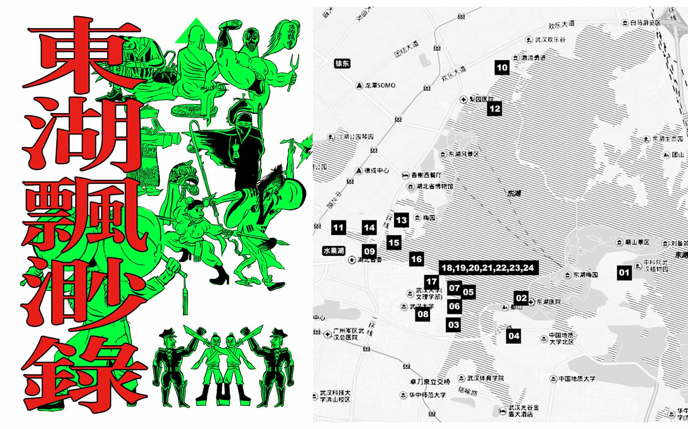
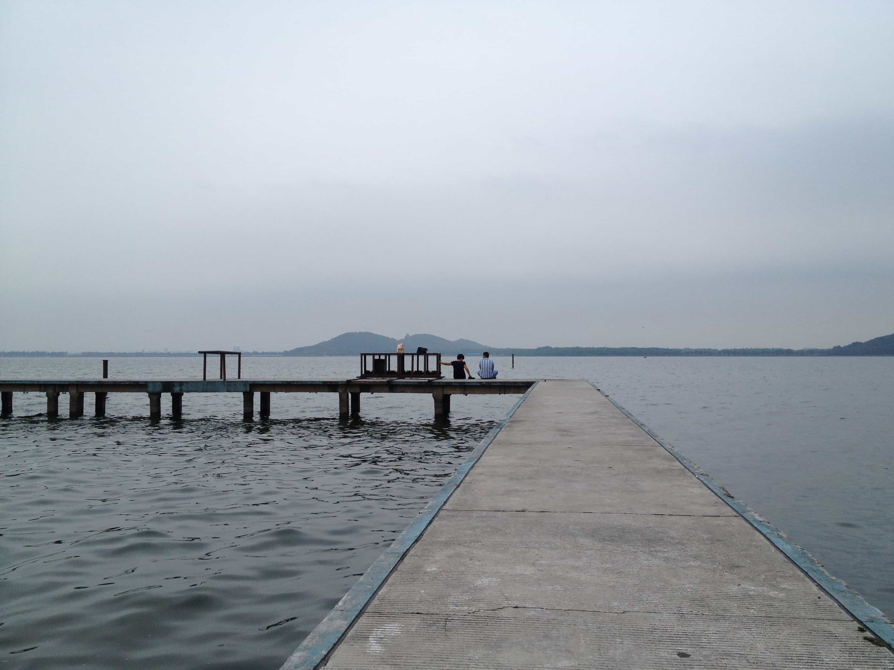
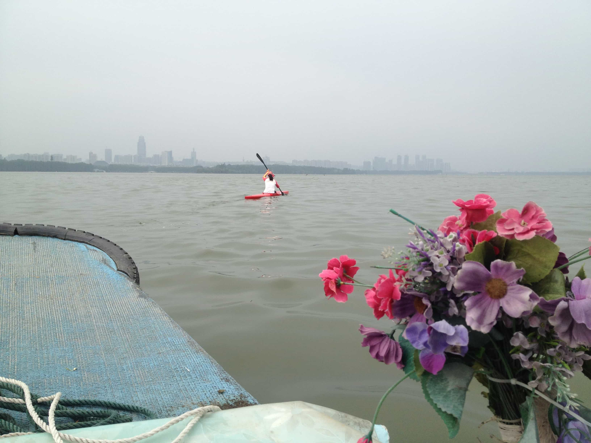
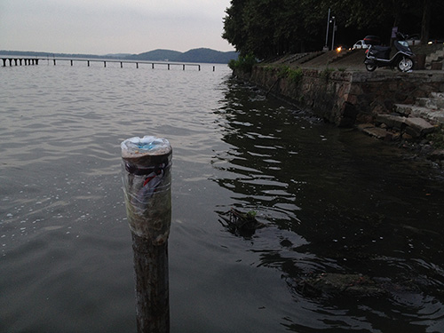
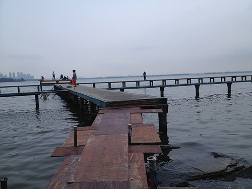
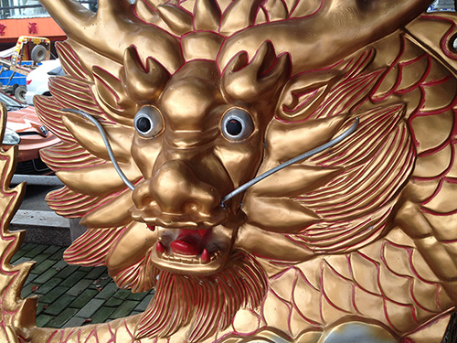
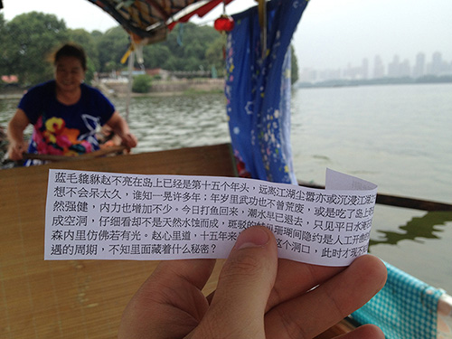
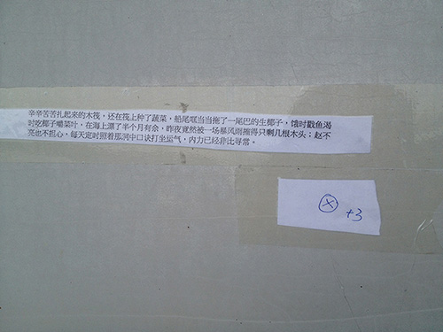
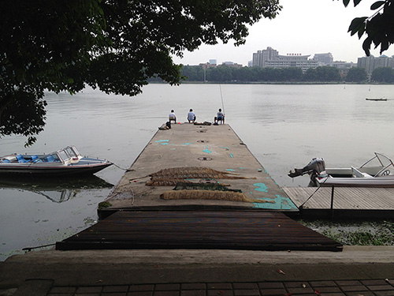
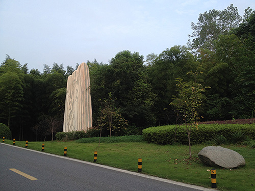
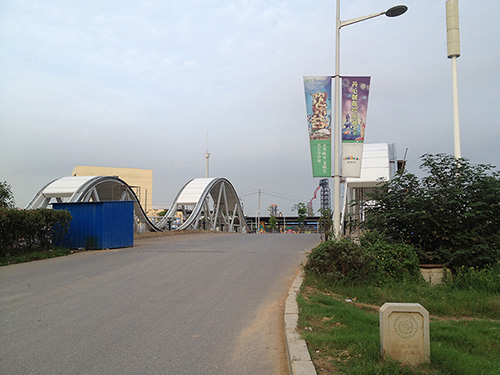
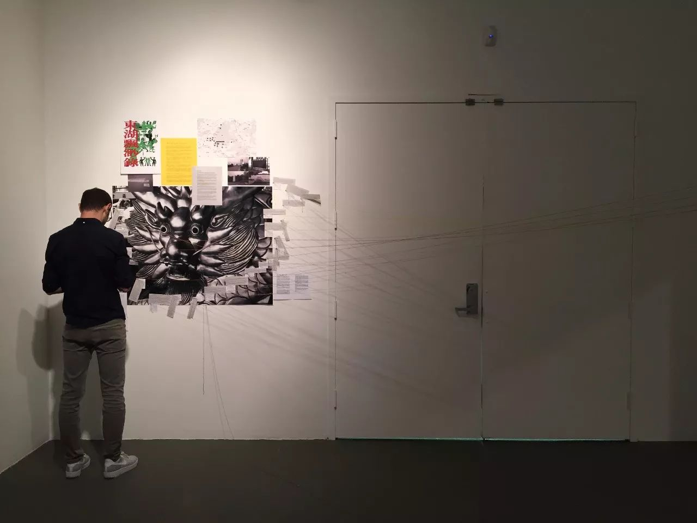
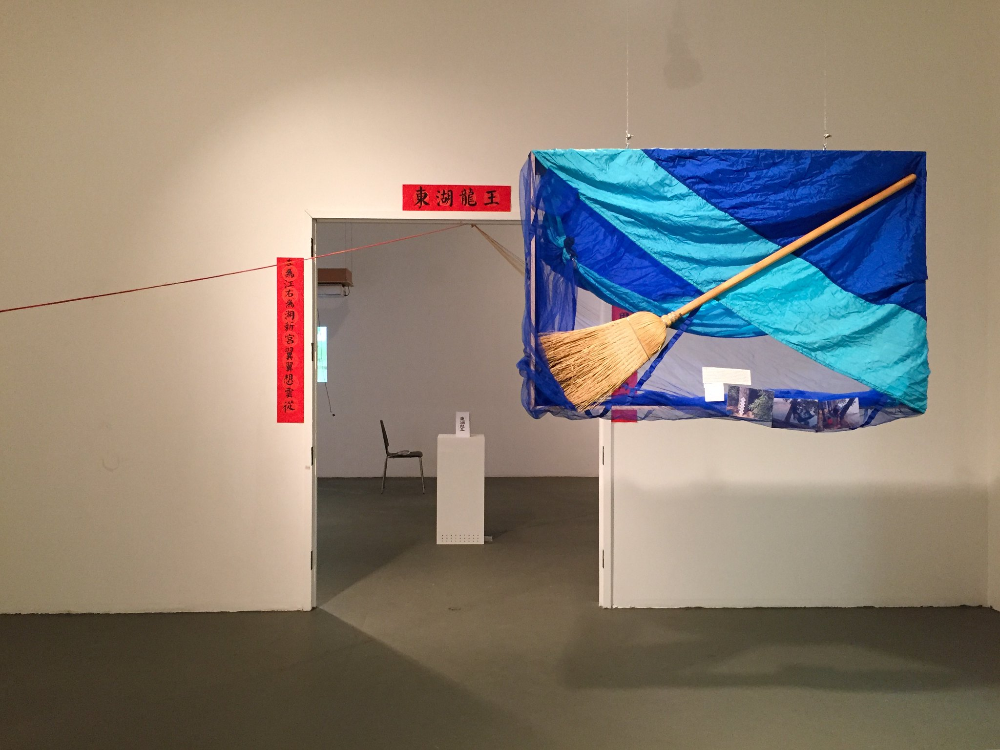
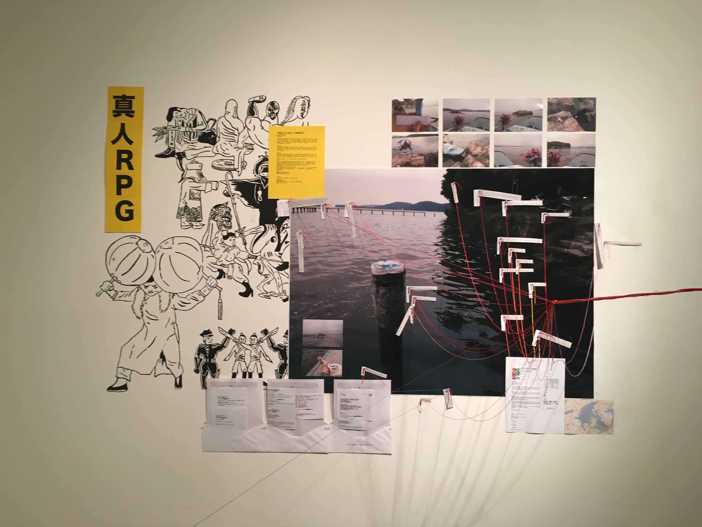
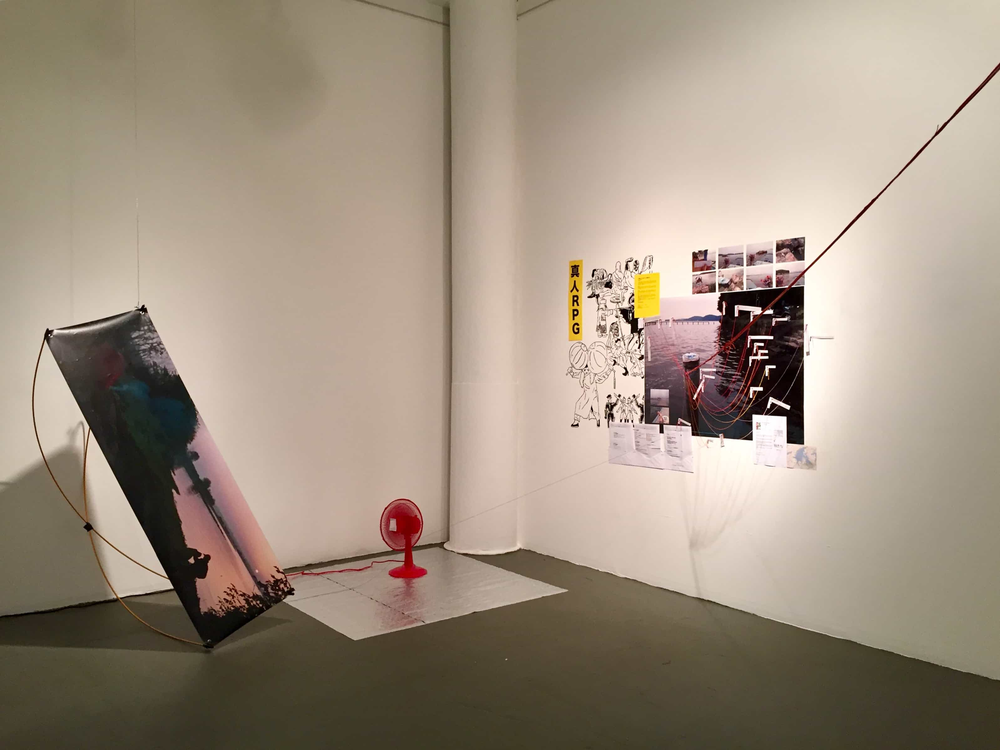
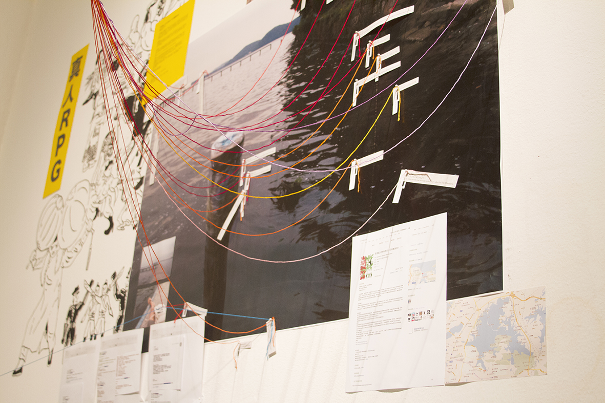

真人 RPG 游戏《东湖缥缈录》
行为/事件，打印纸条 
东湖艺术计划 
武汉，2014

子杰漫游东湖
北京当代艺术基金会，亚洲当代艺术周(ACAW) 
MANA 当代艺术中心，纽约，美国，2017

The Live Action RPG Game: East Lake Netherworld 
Performance/event 
Donghu East Lake Art Project 
Wuhan, China, 2014

Zijie visits East Lake
Beijing Contemporary Art Foundation (BCAF), Asia Contemporary Art Week (ACAW)
Mana Contemporary, New York, USA, 2017

