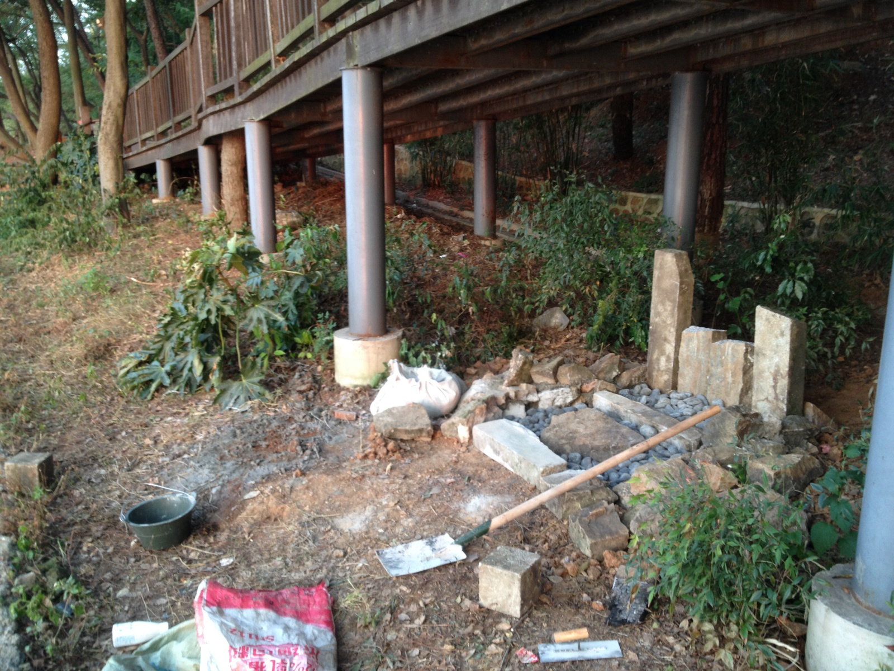
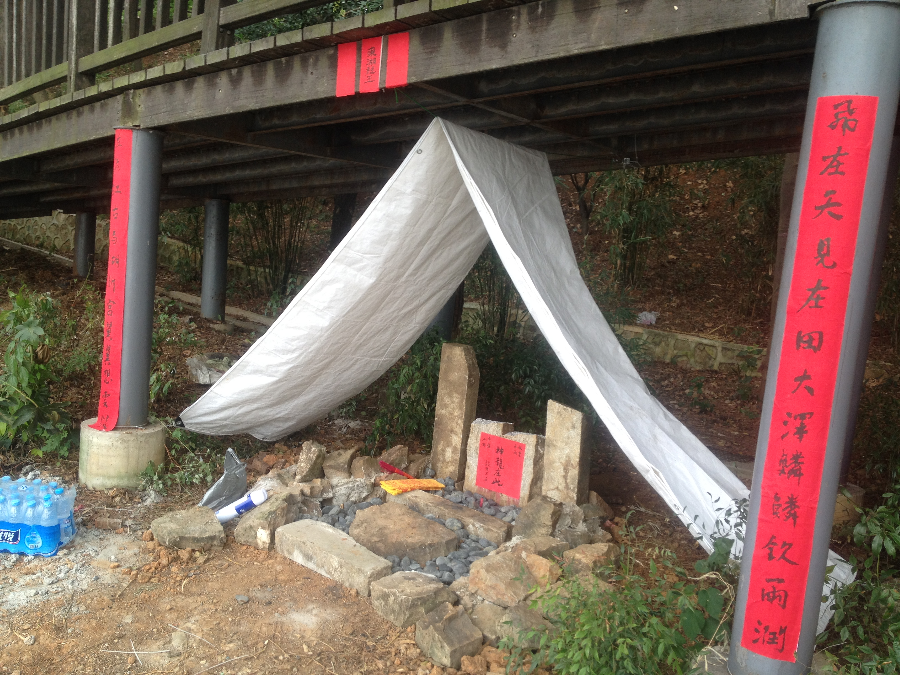
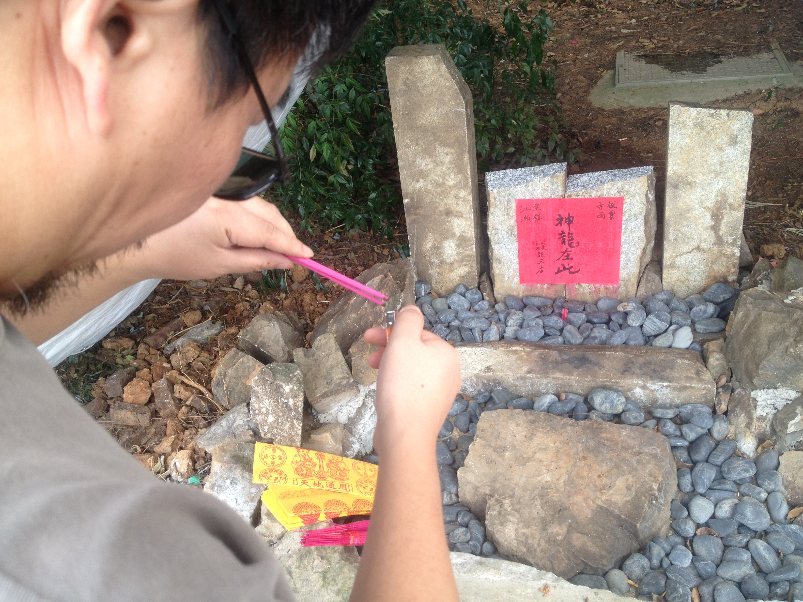
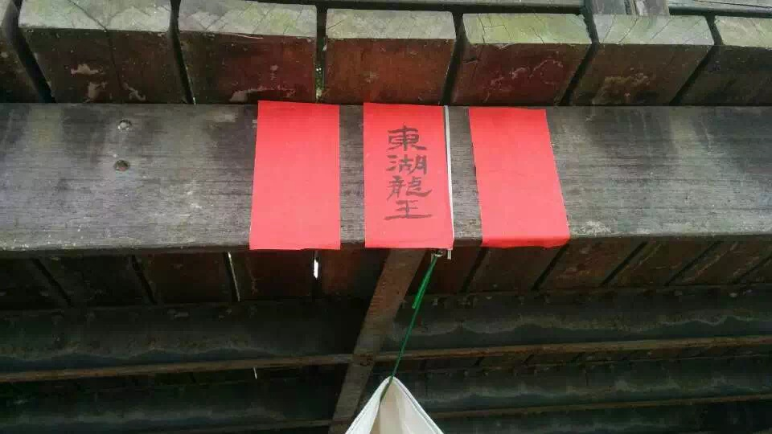
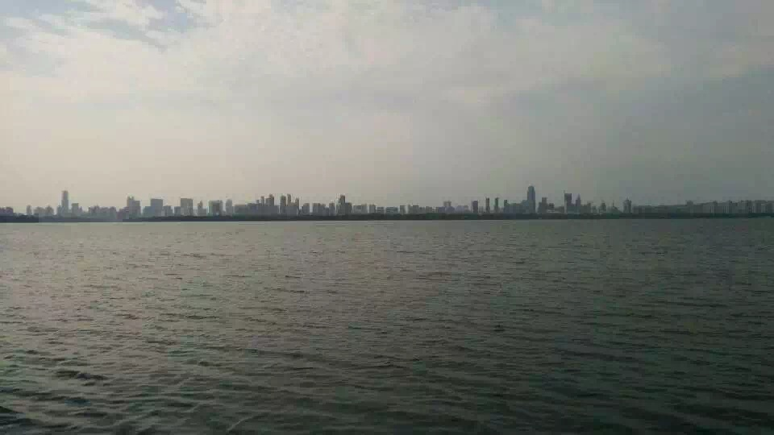
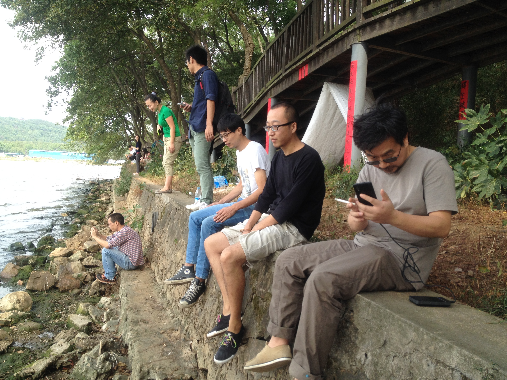
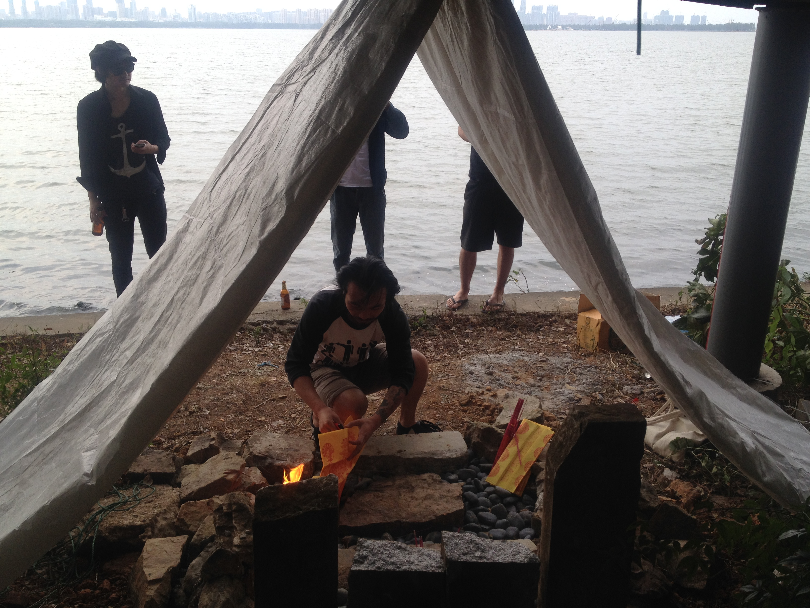
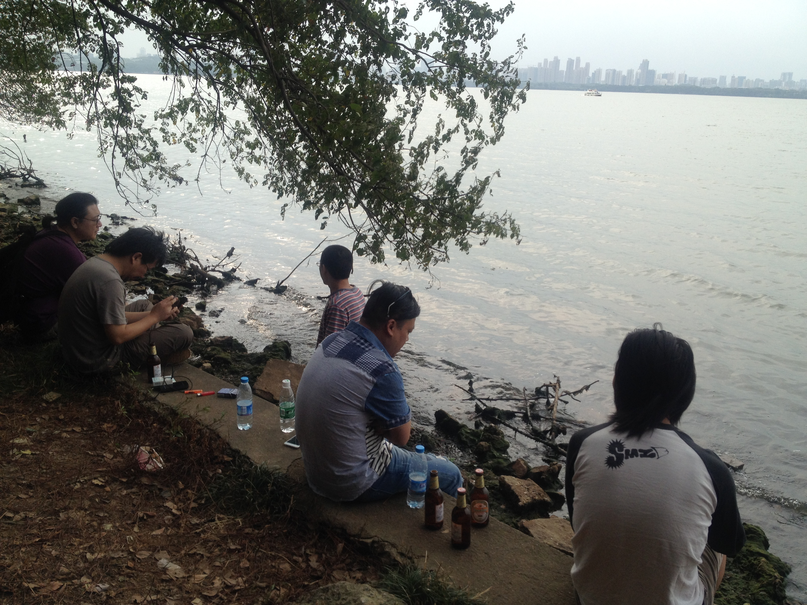

本人在武汉东湖边私建了一个龙王庙，并得到了附近村民的允诺前来上香共同维护，以回应近 年来东湖边各种神奇变化乃至乱象，特别是对湖边高楼林立不断被资本侵蚀的日常生活空间提出 了批评。

*用空间对抗空间，一种空间斗争的方式。......我也盖一个庙，正对着湖对岸层层叠叠的高楼，表 达自己的一些想法，并邀请附近的人们来这里，不是一种对威权的膜拜，而是对此地共同的情感 抒发和维护。* (引用自《为什么盖龙王庙》，空间使用指南系列漫画:《东湖龙王-东湖龙王庙和自治空间》)

I built a Dragon King Temple by the East Lake in Wuhan, and got the promise of the nearby villagers to come and offer incense and joint maintenance, in response to the various magical changes and even chaos by the East Lake in recent years, especially the criticism of the daily life space by the lake, which is continuously eroded by the capital with a lot of high-rise buildings. 

*...use space to fight against the intrusion of space, a kind of spatial struggle...I’ve also built a temple, to express my will against the myriad skyscrapers around the lake now. I also invite people living nearby to visit my temple, not to worship anything in particular, but to express and maintain our mutual connection to the land.* (Quoted from "Why Build a Dragon King Temple?", How to Use Space Comix Series: "East Lake Dragon King - East Lake Dragon King Temple and Autonomous Space")

东湖龙王庙 
行为/事件及漫画，照片记录，漫画原稿，印刷册子
武汉，2015
腹地班车，时代美术馆，广州，2015

East Lake Dragon King Temple 
Performance/event, comics 
Hinterland Project: Bus Guangdong Times Museum, Guangzhou, China, 2015

