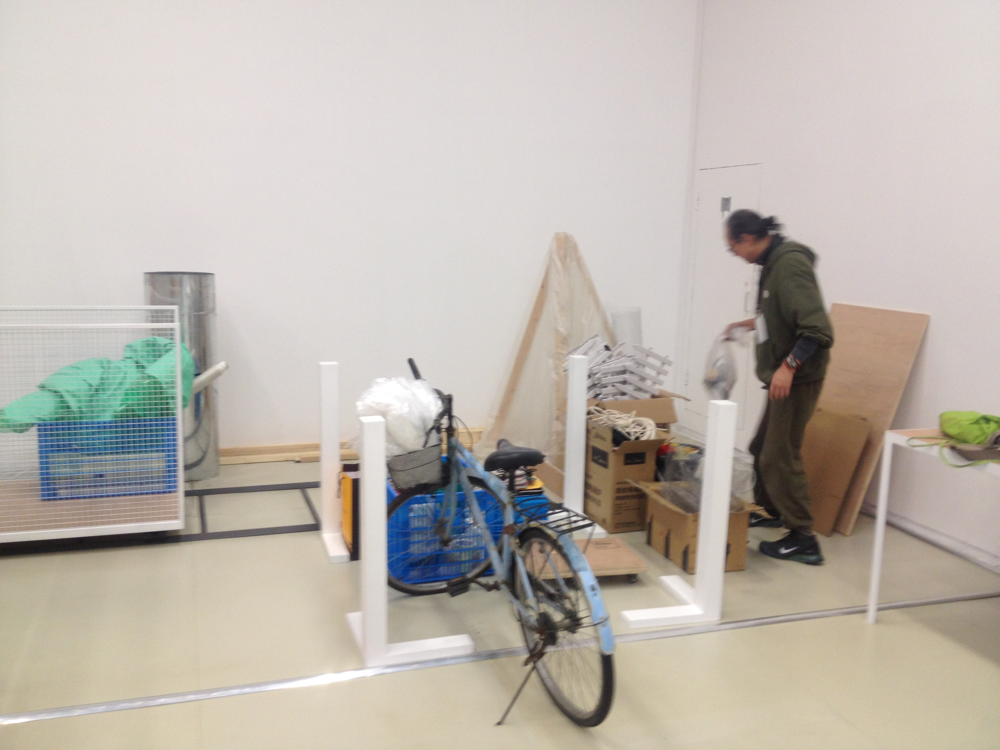

流转仓库回收艺术机构展前展后的遗弃材料及个人不需要的相关艺术剩余物(如半管颜料，一 段画布)、任何新旧日常用品等，以提供给其他艺术家继续利用进行创造。有材料需求的艺术家 只要取有所给，取有所造，将得到的物品用于作品的创作即可取用。流转材料遵从 Creative Commons 协议的创作共用，捐赠者可享有该物品来源的署名权、并可决定其可否用于商业传播， 可否继续演绎。仓库并接受各方物品的捐献。
**Creacycle** collects discarded materials from art institutions before and after exhibitions, as well as unwanted personal art remnants (like half-used paint tubes or canvas pieces) and everyday objects, new or secondhand, giving them a second life through other artists' creations.
Artists in search of materials may **take what is given and create with what they take**, using these items to craft new works. The materials are shared under Creative Commons principles—donors retain attribution rights and specify whether commercial use and derivative works are permitted. The warehouse accepts item donations from all.
more: https://www.douban.com/group/creacycle/

流转仓库 
项目和装置，周转货筐，铁制轨道，轨道车，木制立栏 
青年策展人计划
上海当代艺术博物馆(PSA)，上海，2015

Creacycle Warehouse Project
Project and installation: turnover crates, iron tracks, rail cart, wooden fencing
Emerging Curators Project (ECP)
Power Station of Art (PSA), Shanghai, 2015

