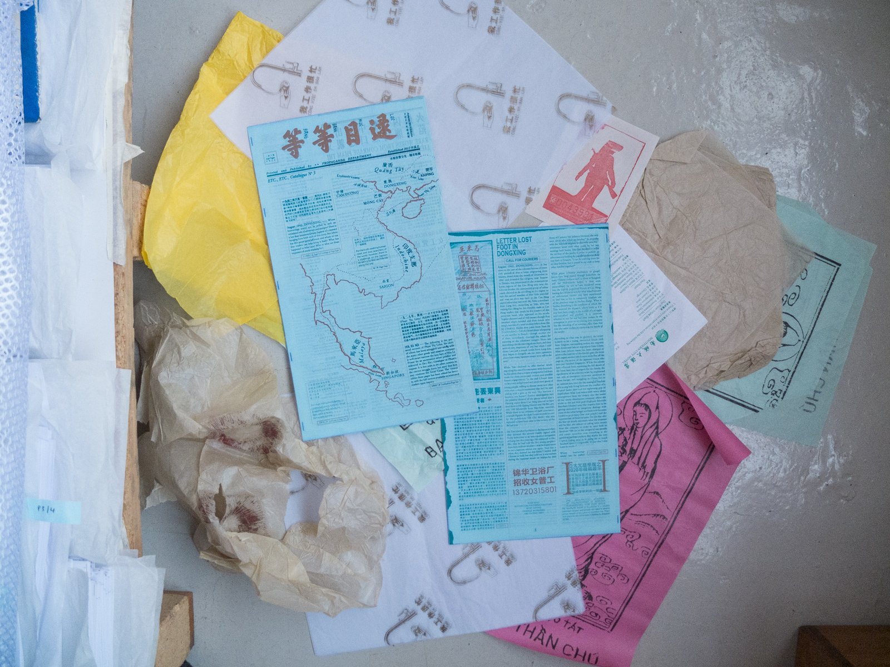
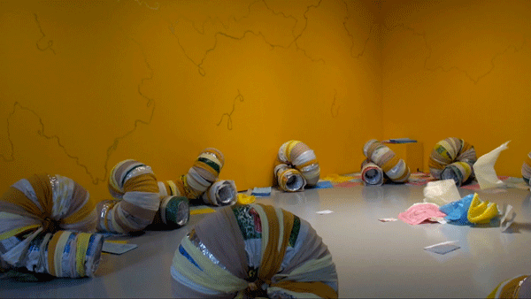
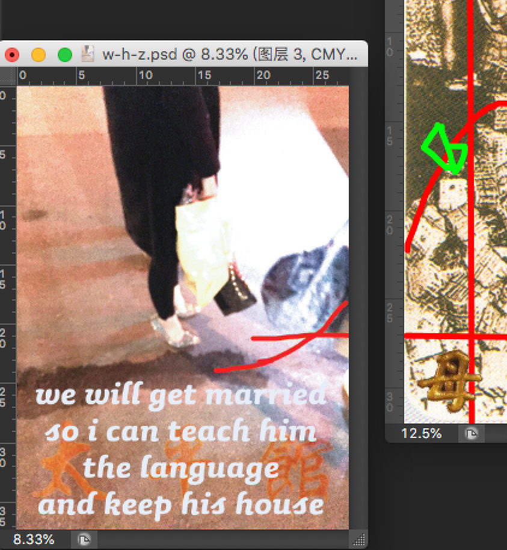
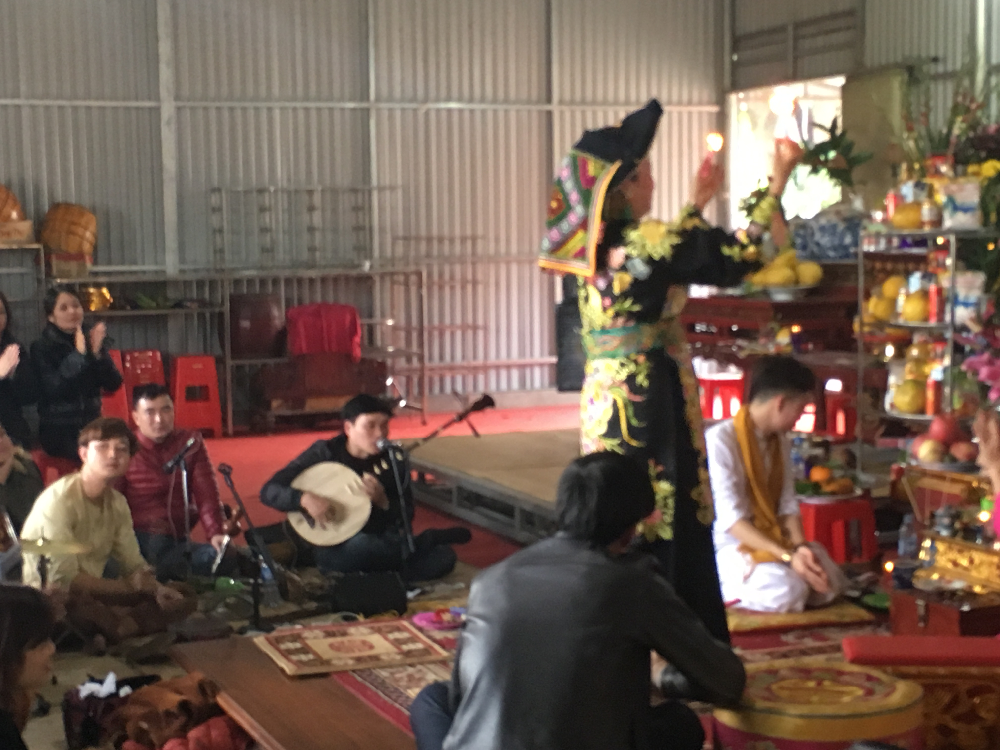
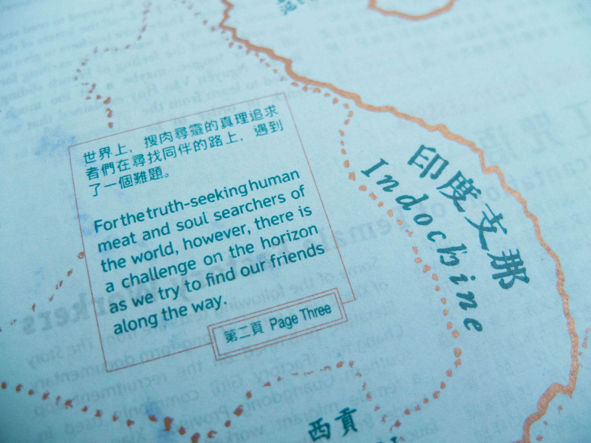
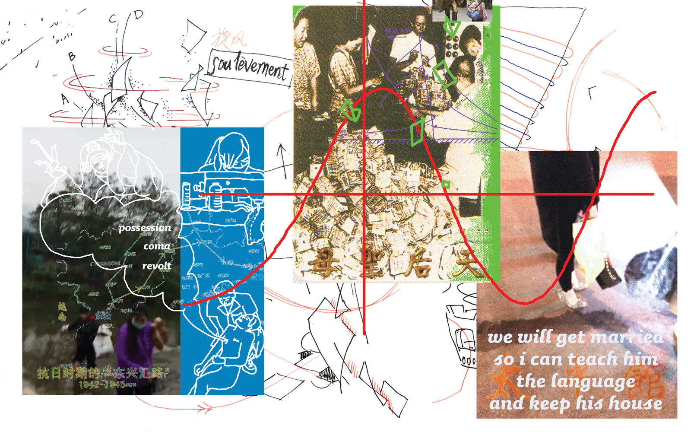
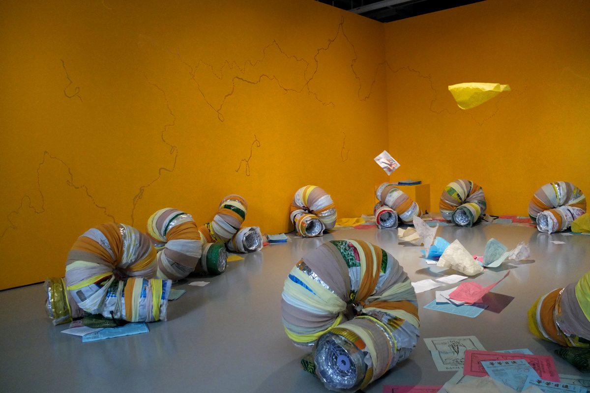

《等等目錄》第三期:即將，已然。其是一個基于田野研究的作品，以風動裝置形式呈現，持續吹拂各式紙片扶搖而上，旋又掉落，周而復始，永不停歇。這些紙片是點點宣傳部在越桂粵三地的文化交匯地帶做研究保存下來的囈語、咒符、行踪、痕跡;觀眾在現場可以進到裝置裡去走去讀。其中和作品同名的傳單或報紙《等等目錄》第三期，是用複寫紙印刷，在和風力的周旋裡頁面互相摩擦碰撞落下隨機劃痕，其持社會學家/文化工作者Mamitua Saber「邊緣的領導者」(marginal leader)的觀念，敲及中越邊境兩地的自組織實踐和自治意向，以女性敘事的形式出版，內容橫跨流傳多個世紀的神話、政 治爭鬥和性別表徵。
該報紙交錯編造了眾多半虛構的角色，越南本地的母道(Đạo Mẫu)信仰-實踐再次通感為敘述手法，記述她們在19世紀末到20世紀上半葉的革命時期頻繁穿越這片地區。這些女性在字面和比喻意義上都跨越了國境，她們的行踪在某種程度上被追溯為情感的生命政治時態，並悄然隱匿在揚起(le soulèvement)的前後過程裡。從女批腳徒步開辟「橋批」匯路的故事，到胡志明第一任妻子曾雪明在越南革命運動中扮演的角色，還有越南战争裡的女游擊隊員，再一直到當代在中國大陸工作的 越南非法勞工，掩蓋和/或忽略的諸形式揭示了私人生活、公共生活和集體行動之間的別樣關係。

Etc., Etc., No. 3: About to, thereafter is a research-based work in the form of a kinetic flow installation which uses mechanically manipulated upstreams of air to circulate a printed leaflet. With Mamitua Saber’s concept of the ‘marginal leader’ as backdrop to considerations of self-organised practice and desired autonomy within the culture-contact regions of northern Vietnam and southern Guangxi and Guangdong Provinces in China, the third edition of the Etc., Etc., broadsheet is published as a female narrative spanning several centuries of myth, political struggle and gendered representation.
The publication creates and interlaces many semi-fictional characters. Inspired by ideas of the local Vietnamese “MotherGoddess” faith (Đạo Mẫu) , the paper records these women’s frequent journeys across the border in the era of revolutions, from the end of the 19th century to mid-20th century. These women led transnational lives both literally and metaphorically. Their whereabouts are traced to some extent as emotional life-political tenses and quietly concealed in the process of “le soulèvement” From the story of female phoe-kha “wading a road on foot”, to the role of Hồ Chí Minh’s first wife Zeng Xueming in the Vietnam Revolutionary Movement, and the female guerrillas in the Vietnam War, to the contemporary illegal labors in mainland China-various forms of cover-up and/or neglect reveal different relationships between private life, public life, and collective action.

《等等目錄》第三期:即將，已然 
风力装置，印刷品，声音 
点点宣传部，小组 
Mamitua Saber项目，新加坡双年展 Lasalle ICA Gallery，新加坡，新加坡，2019

Etc., Etc., No. 3: About to, thereafter 
electric fans, insulating tubes, printed matter of various dimensions, tissue paper, fabric, 5.1 surround sound audio installation 
•• PROPAGANDA DEPARTMENT(group)
commissioned by curator Renan LARU-AN for the Mamitua Saber Project of the Singapore Biennale 
LASALLE Institute of Contemporary Arts, Singapore, 2019

