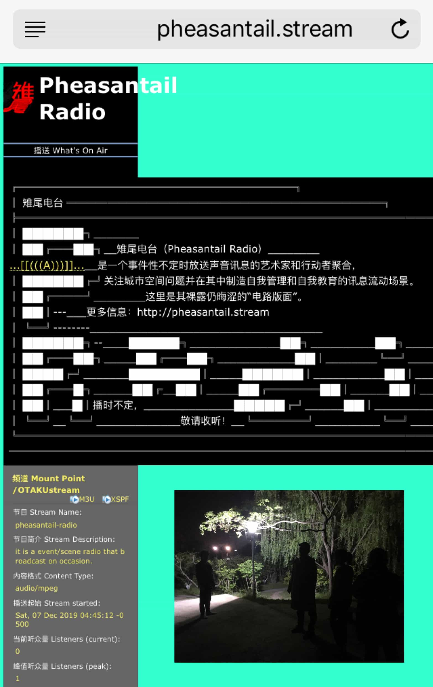
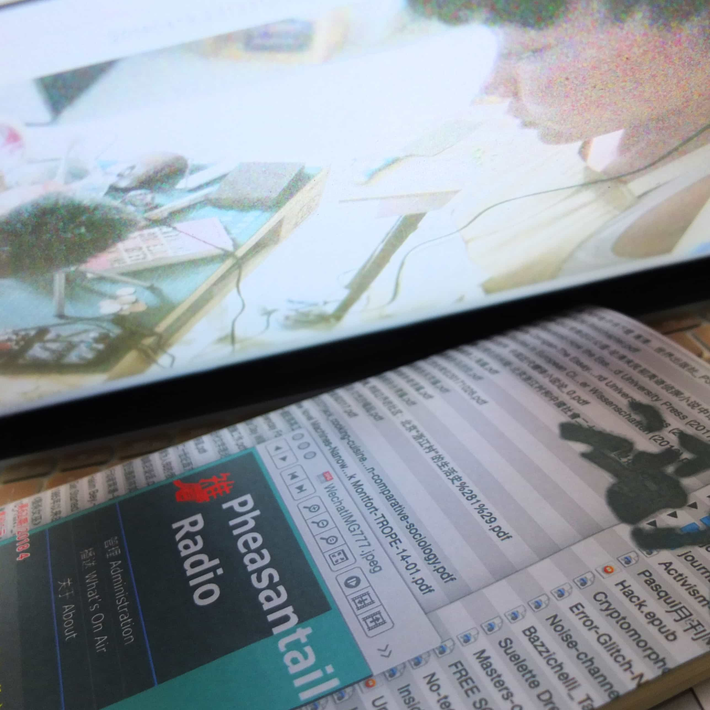
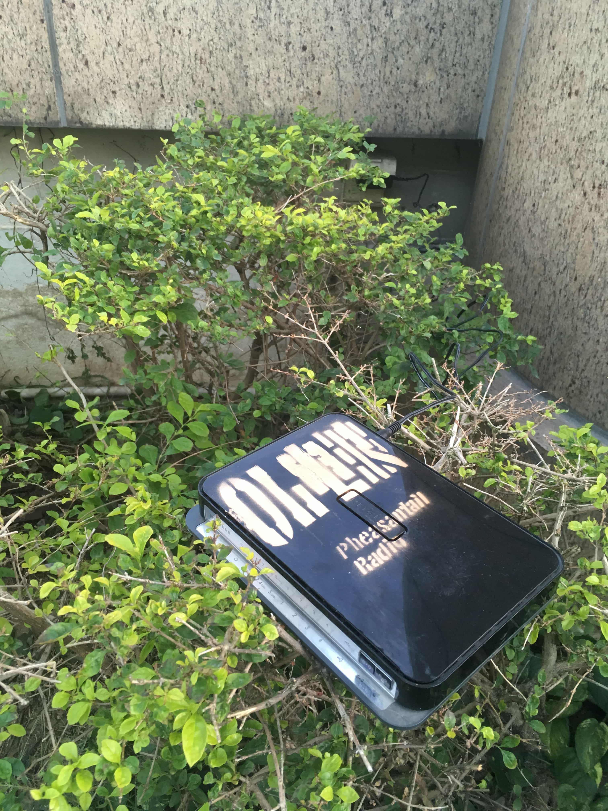
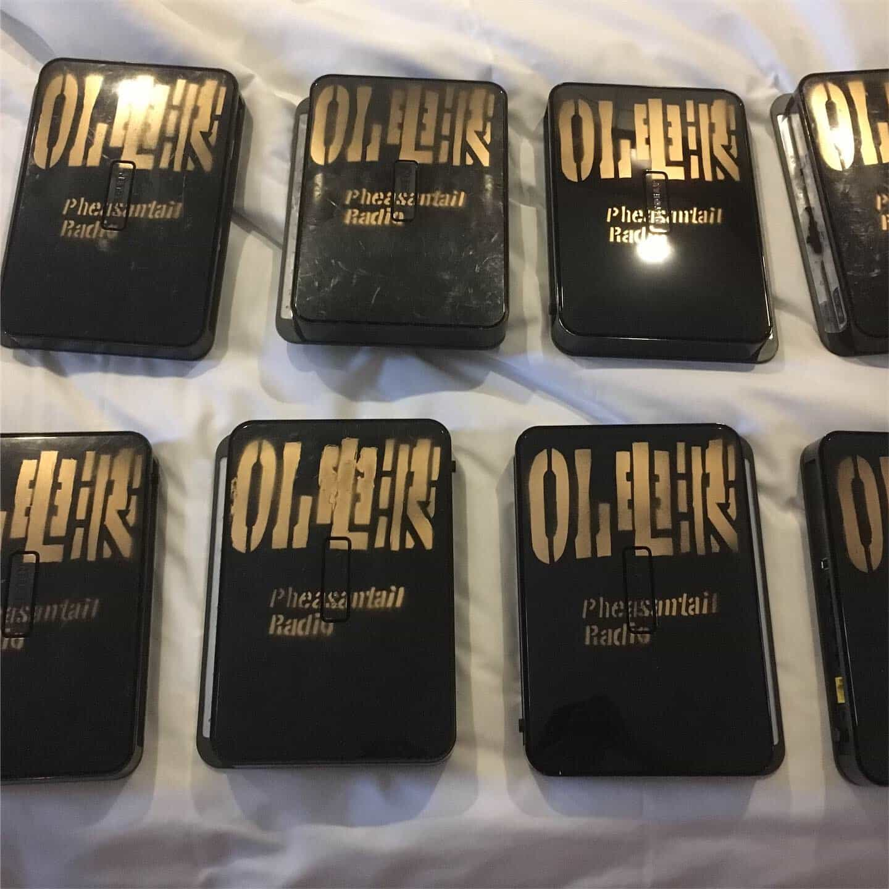

雉尾电台是一个事件性不定时放送声音讯息的艺术家和行动者聚合，关注城市空间问题并在其 中制造自我管理和自我教育的讯息流动场景。第一期播出于 2018 年 4 月 19 日;第二期播出于 2019年12月7日: 

*广州的亿达大厦作为写字楼，每层分租给了不同的公司。员工每日来上班时一定能从无线网络的 层面了解到:不同的公司的 WIFI 信号和密码正宣示着每一层的阻隔。现在他们搜索 WIFI 会发现 一个神秘的信号出现，引导他们登录共同的网络，并从顶楼飞奔到负一楼全信号不断且无阻;同 时他们可以收听到一个“OL 电波”的网络电台节目(OnLine Wave，由雉尾电台提供的特别时段)。* (引用自:http://pheasantail.stream/ )

Pheasantail Radio is a collection of artists and activists who broadcast sound messages at irregular intervals, focusing on urban space issues and creating scenes of self-management and self-education in which messages flow. The first broadcast was on April 19, 2018 the second broadcast will be on December 7, 2019:

*The Yida Building in Guangzhou is an office building where each floor is subleased to a different company. When employees come to work every day, they must know messages from receiving the WIFI signals and passwords from different companies are declaring that each floor is blocked; Now they search for WIFI and find a mysterious signal that leads them to the common network to listen to the "OL Wave" from the ground floor to the top roof withno any border.* (OL Wave stand for OnLine Wave, a special time slot provided by Pheasantail Radio, via http://pheasantail.stream/ )

雉尾电台第二期:OL 电波 
声音出版，广播文件，WIFI 无线信号，电子设备 
建筑，或者建筑:亿达大厦再建计划 
扉美术馆，广州，中国，2019

Pheasantail Radio vol.02: OL Wave 
Sound Publishing 
Architecture, or Building: Yida Building Re-construction
Fei Museum, Guangzhou, China, 2019

