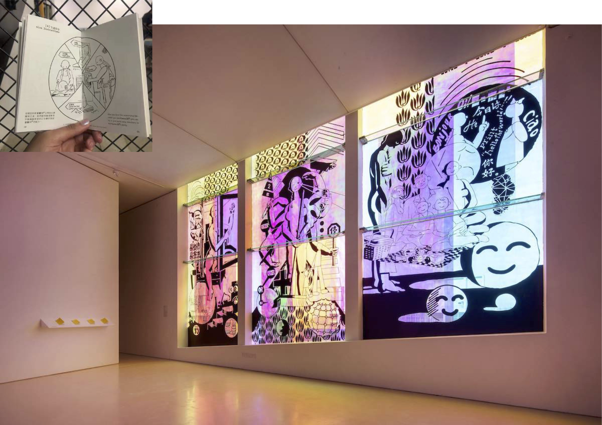
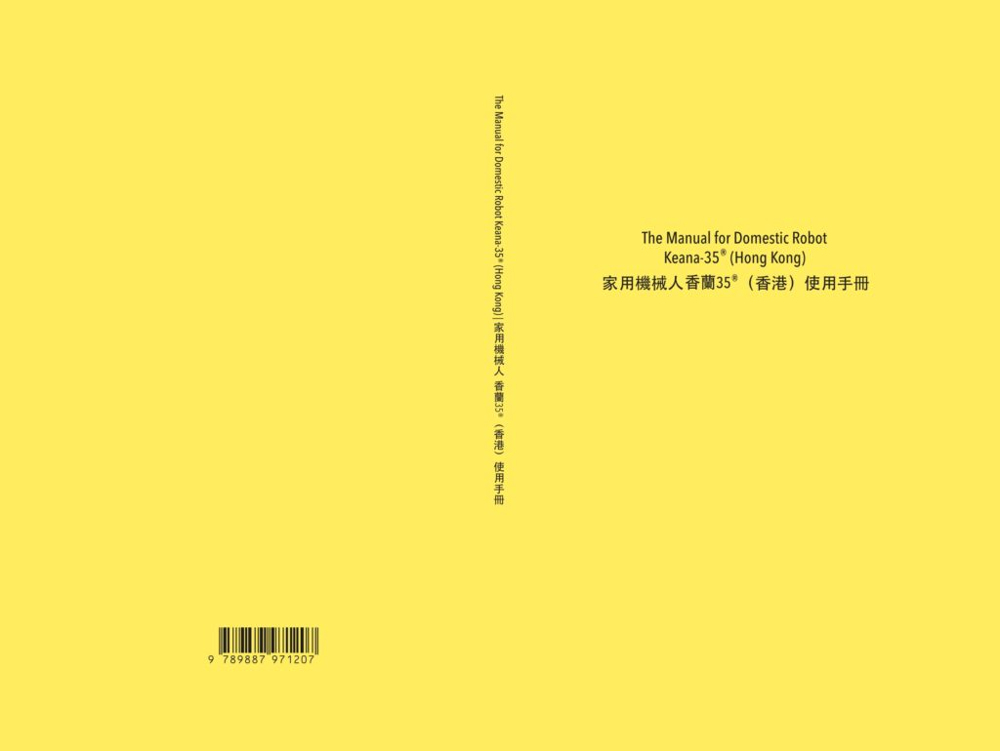
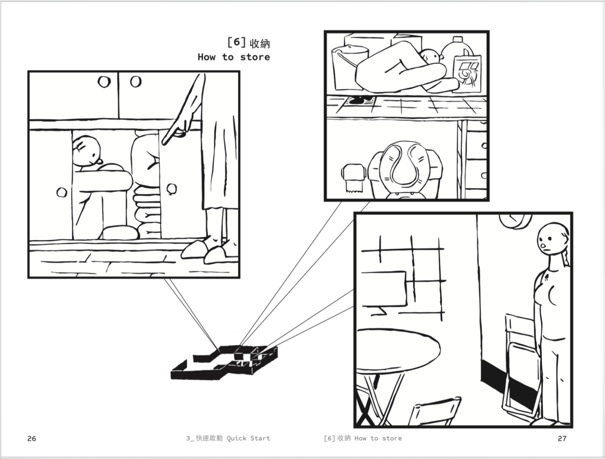

香兰和美好生活是子杰基于《家用机械人香兰 35®(香港)说明书》的工作延续而生的系列绘 画作品。其设想了一个人人都将为自身家庭挑选机器人帮佣的未来，透过将目前香港社会的外籍 雇佣现象作为一种历史文本，打造一个帮佣和家庭一起生活的美丽寓言或广告神话。
《家用机械人香兰 35®(香港)说明书》计划由施昀佑(台湾)所发起，受到谢柏齐(香港)之短篇 小说《菩萨慈悲念女身》启发，同时谢柏齐也是本计画的共同书写者，插画部分则由子杰(中国)完 成，他也同样参与书写部分的讨论工作。该说明手册为艺术家施昀佑邀请香港作家谢柏齐、武汉 漫画家子杰的共同创作。

*我们知道香港人居家空间拥挤:香兰 35®的出现除了照顾大家的居家生活之外，最重要的是为您 解决空间收纳的问题。不用像您雇用外佣需要准备一间独立房间，当您使用香兰 35®时，香兰 35®可以轻易地把身体对折放进家中狭小的空间，无论是浴室和厕所的夹层，或是储藏室的收纳 柜，衣柜的角落，阳台的空间，甚至是如同折叠椅一样靠在牆角，都是您可以选择的收纳方式。 关于更多收纳方式欢迎直接对香兰 35®下达指令，请他在家中空间中寻找一个最适当的地方，无 论是再怎麽潮湿或充满灰尘的地方，他也都可以忍受喔(当然，她也会顺便帮您把这个空间给清洁 乾淨唷)。*(引用自《家用机械人香兰 35®(香港)说明书》第28页)

Keana and the Good Life is a series of paintings by Zijie based on the work of "The Manual for Domestic Robot Keana 35® (Hong Kong)". It envisions a future in which everyone will choose a robot helper for their own family, and by using the current phenomenon of foreign employment in Hong Kong society as a historical text, it creates a beautiful fable or advertising myth of a helper and family living together.  
The project "The Manual for Domestic Robot Keana 35® (Hong Kong)" was initiated by Yunyu "Ayo" Shih (Taiwan) and inspired by the short story "The Bodhisattva's Compassion for the Female Body" by Pak Chai (Hong Kong), who also co-wrote the project, while the illustrations were done by Zijie (China), who also participated in the discussion of the writing part. The booklet is a joint project between the artist Yunyu Shih and the writer Pak Chai and the comics maker Zi Jie.

*We know that Hong Kongese living space is tight: the invention of Keana-35® aims not only to take care of people's life but also to solve storage problem. Different from hiring a foreign domestic helper, you don't need to prepare a separate bedroom. When you use Keana-35®,you can easily fold its body and put it into a small space in the house. Spaces in minuscule bathroom, storage cabinet, closet, and balcony are all good choices. You can even put it against the wall like a collapsible chair. For more storage methods, please directly give Keana-35® directions and ask it to find the most suitable place in the house. No matter how wet or dusty the place is, Keana-35® can endure it. Of course, Keana-35® will clean this space for you.* (Quoted from The Manual for Domestic Robot Keana 35® (Hong Kong),page 28)

香兰和美好生活 
施昀佑+子杰 
绘画，纸质印刷品，玻璃贴膜 
忘忧草:考古女性时间 
广东时代美术馆，2019

Keana and the Good Life 
Yunyu Shih + Zijie 
Installation 
Forget Sorrow Grass: An Archaeology of Feminine 
Time Guangdong Times Meseum, 2019

