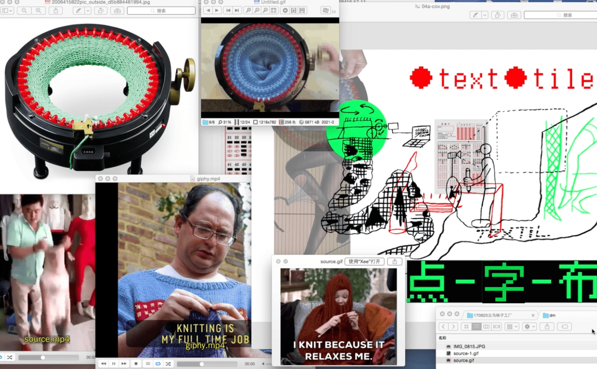
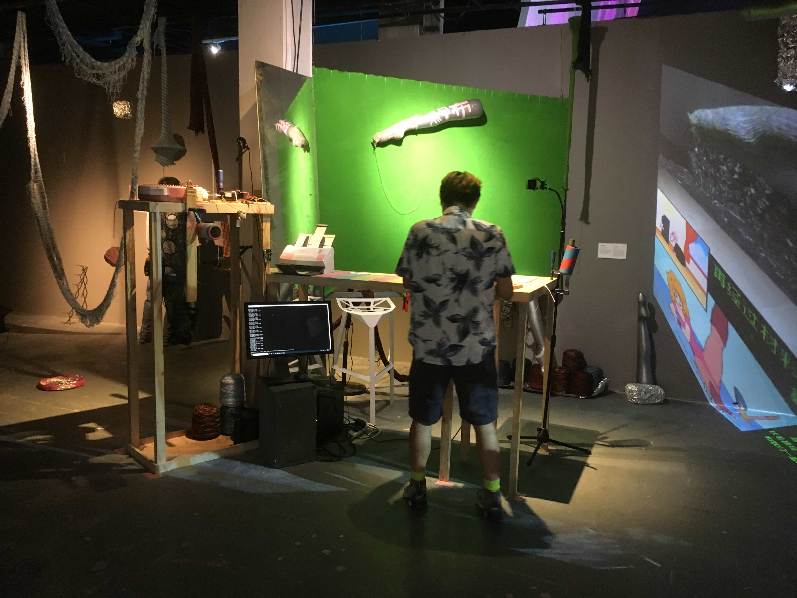
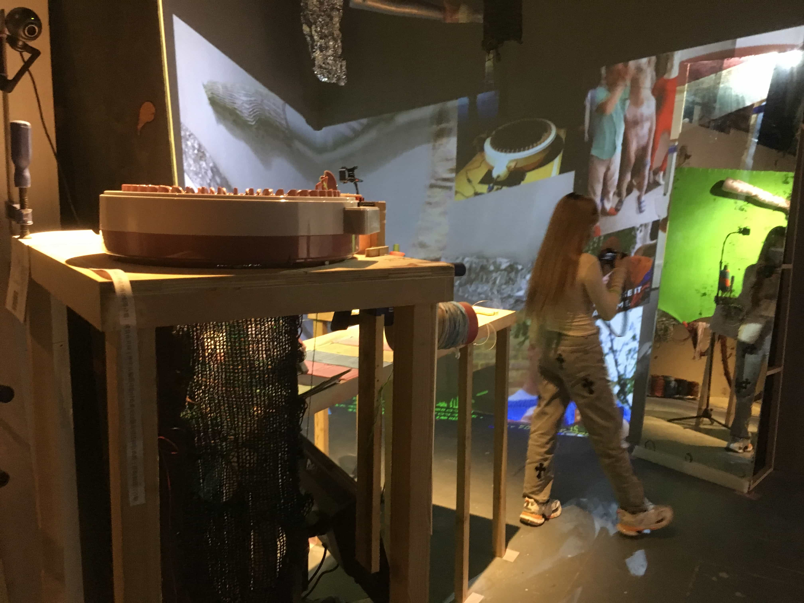
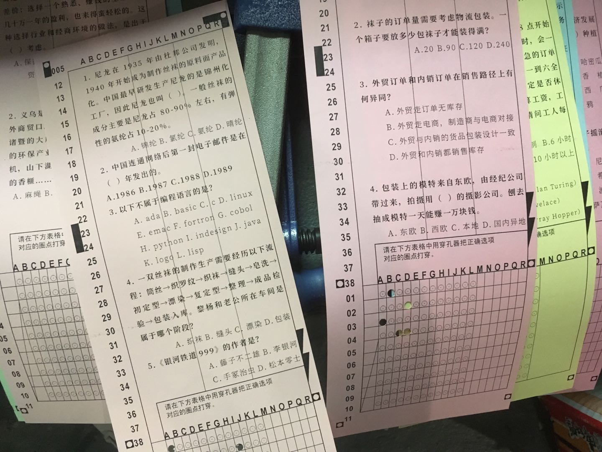
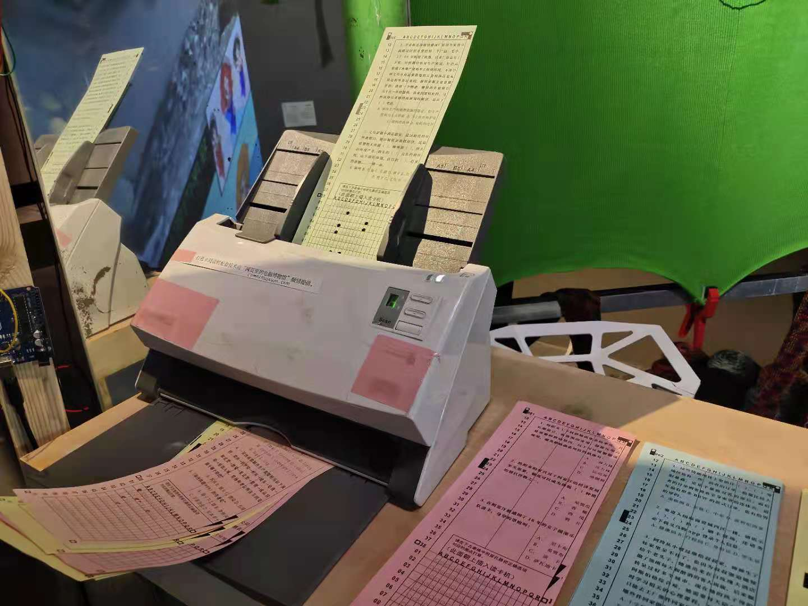
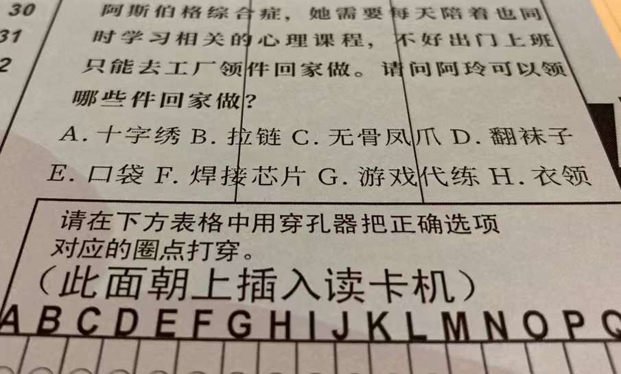
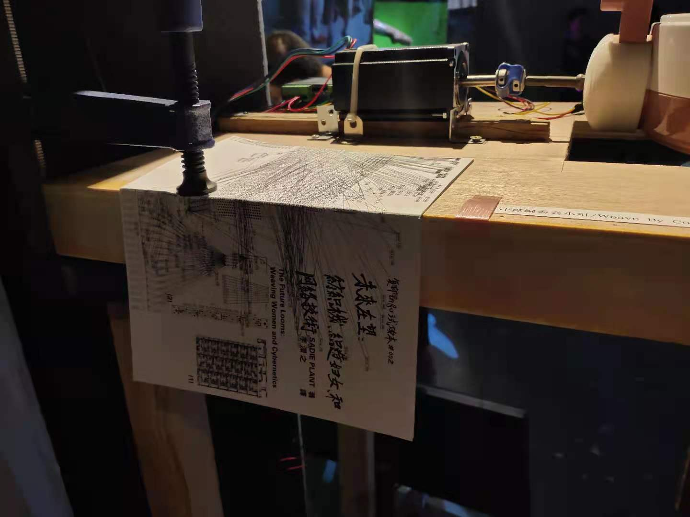
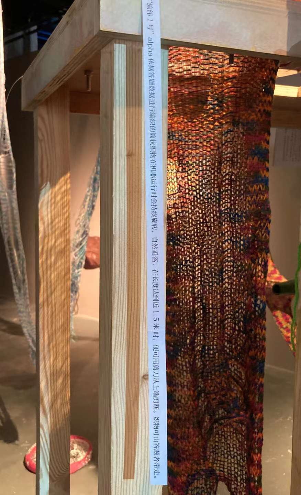
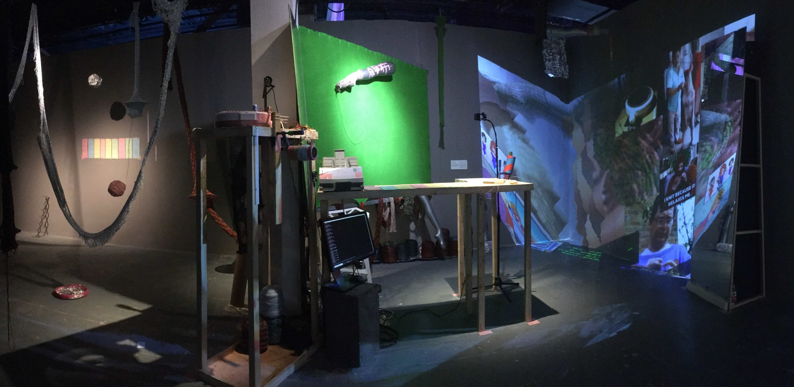

“点_字_布”是基于性别田野、媒介研究和编织自动化技术的一个书写装置:计算机驱动的纺织机 随着数据输入生成基于不同赋值的往复运动，编结筒状的贴身织物，围罩成一个讨论场域。这个 讨论场域涵盖了编织与计算、智识生产的性别属性、编织产品与身体、编织工业中的基于性别的 劳动等议题。
●text●tile is a writing installation informed by the fieldwork on gender, media studies, and automated weaving technologies: a weaving device powered by the computer generates circular movement based on different ranges of data input, weaving together a tube-form piece that is intimate to the body. The installation forms a field of discourse, covering the intersection between weaving and computation, the role of gender in relation to intellectual production, the relationship between textile products and the body, and the questions of gender and labor in the textile industry.

**点_字_布** 
计算编委会(李子杰，温璧伊，周蓬岸)
装置，印刷品
不准停电 
明当代美术馆/ 雷电所，上海，2021

**●text●tile** 
Weave By Committee (LEE Zijie，WEN Biyi， ZHOU Pengan) 
Installation, Prints
DO NOT BLACK OUT! 
MCAM/ Raiden Institution, Shanghai, China, 2021

