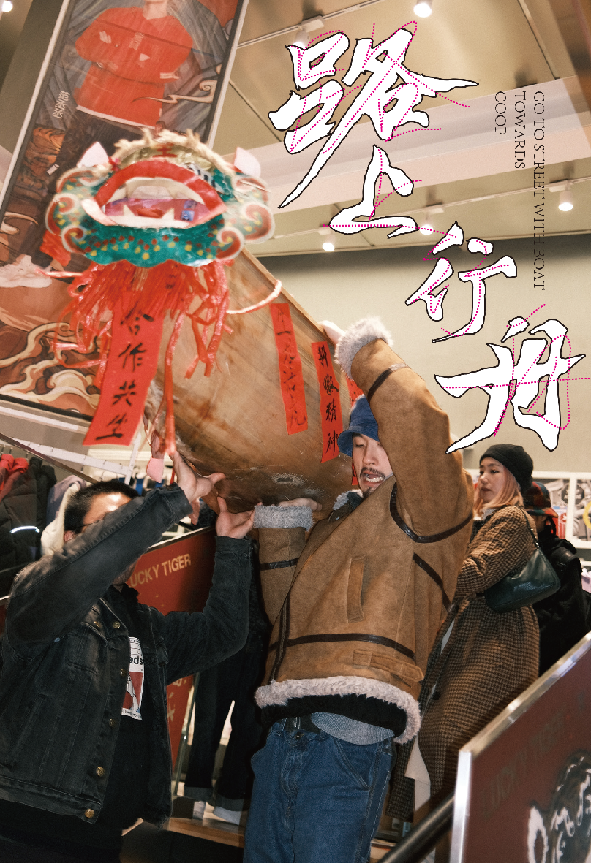
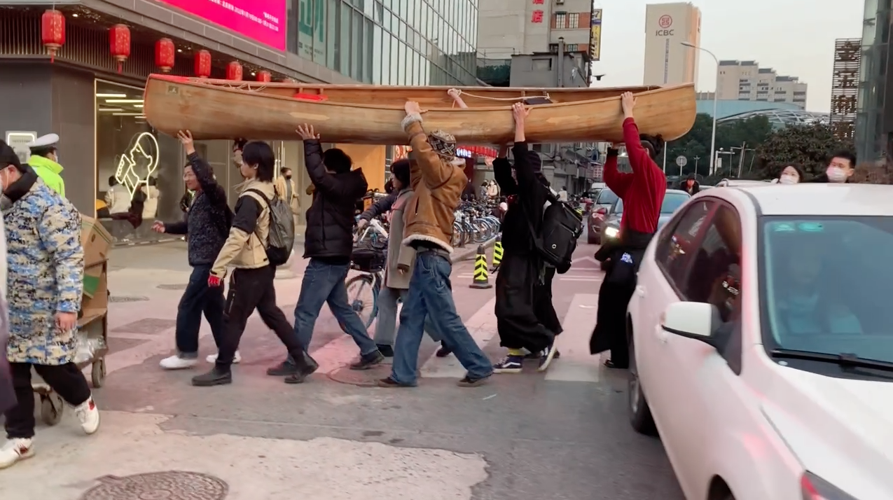
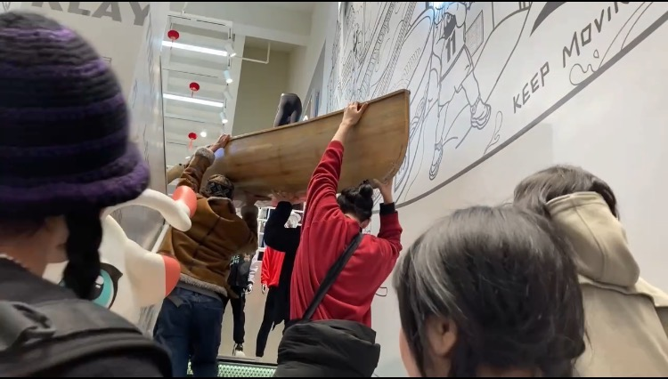
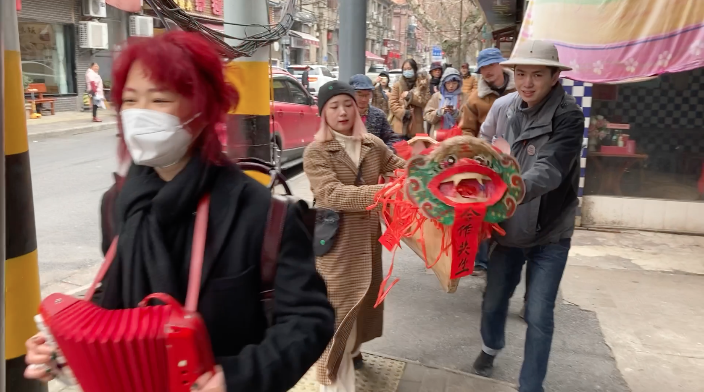

“我们过年的时候把一艘船从武昌运到汉口，抬着船在街道上走了一大圈。”
During the Spring Festival we take a canoe boat into Hankou city (WUHAN) , carrying it through the streets in a big way.

> *Z： ……她说那要去街上造个临时的庙呀！我脑袋里即刻出现了闽南习俗里众人扛着神龛在拥挤又兴奋的人群里穿行的画面，当地逢年过节就会把神请出来用轿子抬着在附近的几个村子游一趟，叫做交游境，意思是神去巡视领地。……（他们）说不如我们就扛着船上街吧！*
> *X： ……格雷伯和妮卡写的那篇《另一种艺术界》第三部分“警察与象征秩序”（_Another Art World, Part 3: Policing and the Symbolic Order_）里面提到，截至2020年以来的全球运动中，很多地方性的抗议找到了共同语言，其中一个就是破坏纪念碑，并且在示威中取而代之制造临时的、易瓦解的木偶……。*
> *H： ……好朋友突然给我发了一张……朋友圈的截图，上面就写着明后出来，我们搞了艘船，画了张路线图。我当时也没太看出来这会是个什么活动，是在江里还是路上？哪里搞得船？谁渡？但好像也不太想知道一个答案，立刻就发消息问……：“船的活动几点呀！”*
> *Z： ……“路上”这个词才能够说清楚我们和船一起进入城市躯体内的漫游，而不单单只是水上的到了陆上的反差和荒谬感。*
> *L： 长江在水的脉络连通着全世界，顺流而下去往大海。（武汉）是沿海城市。*
> *Z： 船头扭进了店里，摆了小半圈；店员全都懵了，脸上是惊奇和欣喜，想笑又不知道该不该笑的模样，问你们是干嘛的。不知道谁说了一句我们在庆祝冬奥会开幕，径直往楼上去。C： 想象中有点类似于把船装上轮子，大家一起坐在里面滑的水路两栖船，又或者是我们把船底凿穿，套进船壳子在陆地上行走，于是在群里问……“都来玩的话，坐不下怎么办？”*
> *J： 那虎头两个眼珠子圆溜溜的，十分地灵气。大家一致认同，同时我们又思考着将挥春作为麟片，在船的两边有秩序地装饰，就这么定了！*
> *H： ……她一路上很兴奋，虽然嘴上说着这些人是她见过最奇怪的人了，自己在里面好像太正常和格格不入了，但是我能感到她和我一样的欣喜和不知所措的悸动。*
> *C： 我们行驶在人流汹涌的江汉路上，航道里的行人像一样的浪花被我们用船拨开，向两侧分去，而他们的目光变成了水珠落在了船和我们的身上。越往中心走，浪花越密集，溅到身上和船上的水珠也就越来越多。……我感受着江汉路，感受着浪花与周遭的一切，……我们在过自己的年……*
> *H： …… 在这些想象的语言之间，好像看到了由一些神话的、口述的、个人的揉杂在一起的一团雾，建立起了某种祭祀般的船的形象在闪动。从自己作为闯入者、不断有街坊陌生人的闯入，到最后我们变成闯入者，有一些对峙角力和互补拉锯的力量、不能被规训和定义的视角产生了。*
> *P： 路上行舟，自然即是航线。在初五这迎财神的日子，……W.T.P……同时也有了“过江虎”新成就。*

>> **Z:** *...She said, "Then why not build a temporary temple on the streets!" Instantly, an image flashed through my mind from Southern Fujian traditions: crowds carrying a divine palanquin through a festive, jostling street. During festival seasons, locals would bring out the deity on a sedan chair to tour neighboring villages—a ritual known as _jiaoyoujing_ (territorial procession), symbolizing the god inspecting their territory. ...They said, "Why don't we just carry the boat onto the streets!"*
> **X:** *...In "Another Art World, Part 3: Policing and the Symbolic Order," David Graeber and Nika Dubrovsky note that in global movements up to 2020, many local protests found a common language. One key tactic was pulling down monuments and replacing them during demonstrations with temporary, ephemeral puppets...*
> **H:** *...A close friend suddenly sent me a WeChat Moments screenshot that read: "Come out tomorrow or the day after. We got a boat and mapped out a route." At the time, I couldn't quite tell what kind of event this was going to be. Was it in the river or on the streets? Where did they get a boat? Who was rowing? But I didn't really care about getting a definite answer; I just immediately texted back, "What time is the boat thing!"*
> **Z:** *...Only the term "on the road" captures our roaming alongside the boat into the living anatomy of the city—it goes far beyond mere absurdity or the spatial contrast of bringing a watercraft onto land.*
> **L:** The Yangtze River connects to the whole world through its aquatic network, flowing downstream toward the sea. In this sense, Wuhan is a coastal city.
> **Z:** *The bow of the boat veered into a shop, turning half a circle inside. The staff were completely baffled—their faces a mix of astonishment and delight, looking as if they wanted to laugh but weren't sure if they should, asking what on earth we were doing. Someone blurted out, "We're celebrating the opening of the Winter Olympics!" and headed straight upstairs.*
> **C:** *I imagined something like putting wheels on a boat—an amphibious craft we could all sit in and slide along—or maybe knocking out the bottom of the boat so we could wear the hull and walk on land. So I asked in the group chat, "If everyone comes to play and there isn’t enough room to sit, what do we do?"*
> **J:** *Those two eyes on the tiger head were round and brimming with vitality. Everyone immediately agreed. At the same time, we thought of using Spring Festival couplets (_huichun_) as scales, systematically decorating both sides of the boat. And just like that, it was settled!*
> **H:** ...*She was thrilled the whole way. Even though she kept saying these were the weirdest people she'd ever met and that she felt too "normal" to fit in, I could feel her excitement and the bewildered, fluttering joy we both shared.*
> **C:** *We navigated down the surging crowds of Jianghan Road. Pedestrians in our channel parted like waves pushed aside by our bow, while their gazes transformed into water droplets splashing onto the boat and our bodies. As we approached the center, the waves grew denser, spraying more and more droplets over us. ...I felt Jianghan Road, feeling the waves and everything around us... We were celebrating our own Lunar New Year...*
> **H:** ...*Amidst these imaginative voices, a mist woven from myth, oral history, and personal memory seemed to take shape, giving rise to a shimmering, ritualistic image of the boat. From being intruders ourselves, to local residents repeatedly intruding into our space, until finally we became the intruders once more—a dynamic of confrontation, tug-of-war, and mutual complement emerged, generating perspectives that resist discipline and definition.*
> **P:** "*Go to street with boat towards COOP"—nature itself becomes the waterway. On this fifth day of the Lunar New Year, welcoming the God of Wealth... WTP... also unlocked a new achievement: "Water Tiger Party" (WTP).*

《路上行舟》

发起单位：jamming、spring、穿山甲艺术空间、武汉涅槃、复印info、大华等。事件参与者：Chenchen、Hanhan、Luxi Liu、Jenson、Plike、大桥和安安、大华、发发、龚豪和牛牛、韩倩及其朋友、金鱼、江宜、堃、李可和乔巴、李海冰及其朋友、柳清、阿平、石星星、马桓、潘晨农、吴智强、辛恒、严安、杨子晨、子杰、中中……等一起参与上街过年的朋友们。

行为/事件，视频记录，印刷品
武汉，2022

步行指南，长征空间，北京，2023

水土不伏：都市边界、映像对话，国立阳明交通大学文化研究国际中心，台北，2024

武汉春信，Bungee Spcae，2024
方言角：日落过早，重音姐妹，纽约，2025
武汉行为艺术影像，重音社，纽约，2026

**Goto street with Boat towards COOP** (2022)
Performance/event, 
Video record, printed matters

Walking as a method, Long March Space, Beijing, 2023

Interflow: Screening Series on Urban Frontier, National Yang Ming Chiao Tung University ICCS, Taipei, 2024

Spring message of Wuhan, Bungee Space，2024
Accent Dialect Corner: Breakfast After Dusk, Accent Sisters, NY, 2025
Art as Social Action: Wuhan! Accent Sisters, NY, 2026

