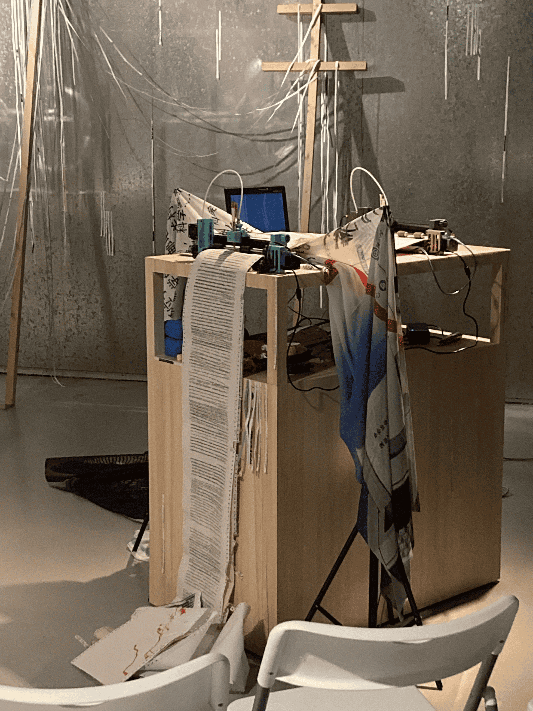
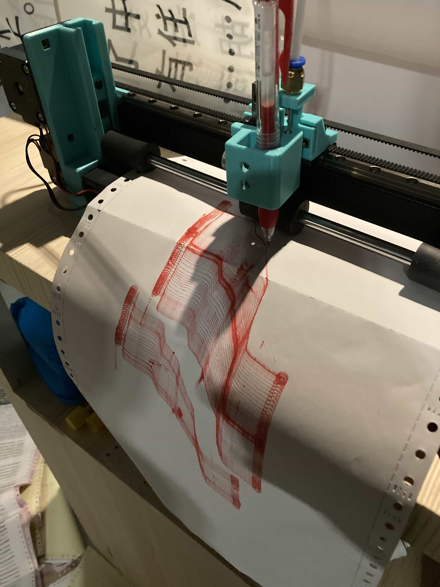
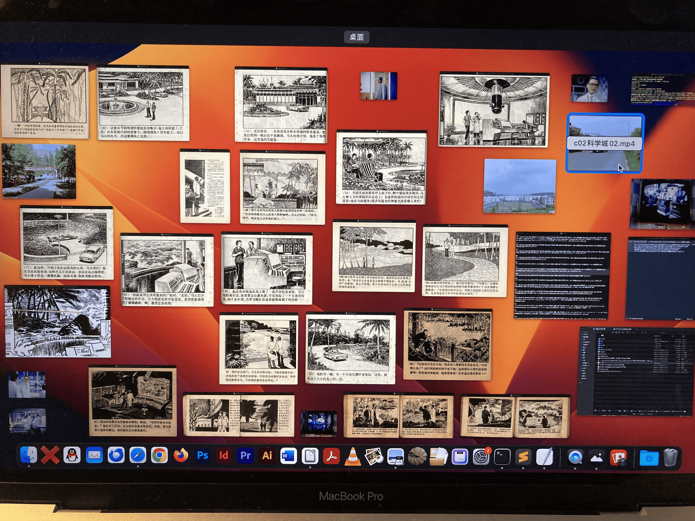
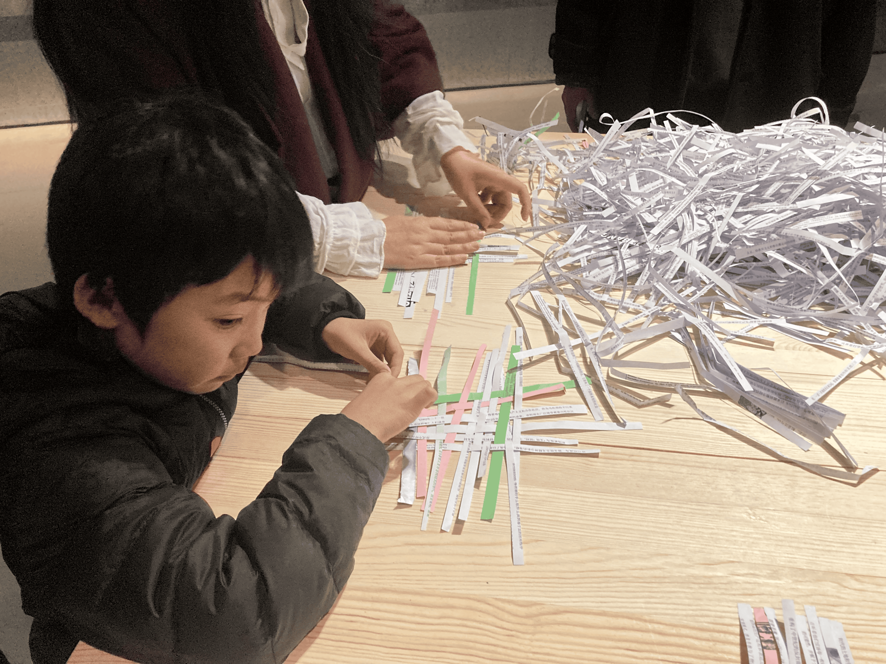

漫步科学岛:论中文文字处理机和写作、权力、资本及技术
A WANDERER ON THE SCIENCE ISLAND:
On Chinese word processing and writing, power, capital and technology

从2020年春夏始以“中文文字处理机:写作、权力、资本及技术 ”为暂定题开始相关研究，子杰从中文文字处理这 个媒介物入手，讨论中文语境下的计算机技术和写作、权力、资本之间的关系:计算机技术从80年代末开始进入中国 的办公视野而后步入家庭，中文的数字化是整个开始的开始;当时鼓励国企单位孵化和参与民企的浪潮中，使得中文 输入大众化的四通(Stone)公司及其打字机在商业上也取得巨大成功，其与80末90初中国社会的一系列政治和经济 变化相映相连;也从那时开始，越来越多的写作者和普通人转而使用(计算机)键盘来写作、处理文字。 中文世界计算机“中古史”的诸要素，是否正是中国新自由主义现状、中国赛博技术变化等云雨翻滚的某个原点?电 子化办公和写作的关系是怎样的?写作工具/媒介变化后，即由纸笔转到键盘上对写作本身是如何影响;人和机器、 技术的关系又是如何?这些问题将围绕着这初始原点的一块“石头”，多种石花枝桠盘根错节列为秩序排绕，并由一 位名为“深之”的人物串联起来，企图丢弃原有的单一时间线因果，进入多种技术历史的叙述、多种技术未来的想象 的可能的讨论。

Realized here as a lecture performance and installation, Wanderer on the science island... is a publication project charting the relationship between computer technology, writing, power, and capital. Based on translations by the artist of contemporary academic works, it traces a social, economic, and political history from the entry of computer technology into homes and offices in the late 1980s through to the digitization of every aspect of our lives. Spanning multiple narratives, timelines, and possible futures, Zijie’s work asks how our changed relationship to digital technology has influenced contemporary culture and society and reflects on where it might be leading us.

深之在科学岛，(复制?)了不断繁衍的...:论中文文字处理机和写作、权力和资本及技术
装置、印刷品、表演性讲座 
宇宙电影，第十四届上海双年展，
上海当代艺术博物馆，上海，2023

漫步科学岛
装置、印刷品、表演性讲座
人工智能时代：从所有权终结之时出发，
广州时代美术馆，广州，2025

表演性讲座：
第七届中国美术学院网络社会研究所年会，武汉/杭州/网络，2022
五金空间，北京，2023
机械工业出版社MC艺术与科技实验室，北京，2023
前台osf，广州，2023
Asymmetry 艺术基金会，伦敦，2024
诗斧书店，香港，2024
微线体艺术空间，武汉，2024
Kunci空间，日惹，2025
中国美术学院跨媒体学院，杭州，2025

**SHENZHI LEE on the science island: (Repites?) la multiplicación del universo. Project Chinese word processing, on writing, power** 
Installation, Prints, Lecture Performance
Cosmos Cinema, 14th SHANGHAI BIENNALE PSA, Shanghai, China, 2023
https://www.powerstationofart.com/whats-on/programs/shanghai-biennale-2023/artists-and-artwork/zijie

A WANDERER ON THE SCIENCE ISLAND: On Chinese word processing and writing, power, capital and technology
Installation, prints, lecture performance
_AI, as Seen at the End of Owership_ , Times Museum, Guangzhou, China, 2024

Lecture Performance History:
7th Annual Conference of the Institute of Network Society (INS), China Academy of Art, Wuhan/ Online, 2022
Wujin Space, Beijing, China, 2023
MC Art & Technology Lab, China Machine Press, Beijing, China, 2023
Qiantai-osf Space, Guangzhou, China, 2023
Asymmetry Art Foundation, London, UK, 2024
See Through Poetry Bookstore, Hong Kong, China, 2024
Microneme Art Space, Wuhan, China, 2024
KUNCI Cultural Studies Center, Yogyakarta, Indonesia, 2025
School of Intermedia Art (SIMA), China Academy of Art, Hangzhou, China, 2025

