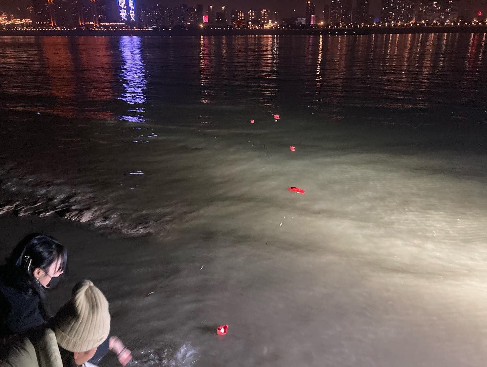

2023年春节前后，武汉的朋友们为了延续上年在街头过年的行动，在城里不断寻找合适的地方可以放音乐、露营、烧火和开趴，每天在不同地点尝试demo party …… 他们发现这个城市最中心位置的江边竟可以搞最野的趴体。于是一场不要分隔要见面的相聚开始了；“此地会是我们在这个城市里放牧路线的其中一个营地，songline上的一点。”之后武汉的年轻人也陆续开始在不同的公共空间如废墟、桥洞办起各种野趴。
Around the 2023 Spring Festival, seeking to sustain the momentum of the previous year's street action (_Go to street with boat towards COOP_), a collective of friends in Wuhan actively scouted the city for spots to play music, camp, light fires, and throw parties, testing out "demo parties" in different locations every day... They eventually discovered that the riverbank at the very heart of the city could host the wildest parties of all. Thus began a gathering that rejected isolation and demanded physical togetherness: _"This site will serve as one of the camps along our grazing route through the city—a node on our songline."_ In the period that followed, young people across Wuhan gradually began organizing wild, rogue parties in a variety of public spaces, from urban ruins to underpasses and bridge piers.

《武汉过年七天乐》

发起单位：武汉过年七天乐小组。
事件参与者：高晓宇、李可、金鱼、严诚、龚豪、孙帮瑞、街坊、小武一家、胡安什、sway、泥巴、面向空间、夏杰、叶无忌、Husky、Oka、Pengpeng、happy、成进、米洛笛、炭叹、晨心、小山、陈世友、杨寒、吴昊、陈岑、fafa、梓杨、严安、小韦、柳清、天南、ash、阿兰、余韵、江华、李思辰……等一起参与过年七天乐的朋友们。
摄影：Husky、Oka、Pengpeng、成进、胡安什、刘真宇、米洛笛、炭叹、严诚、子杰等。
剪辑：子杰、龚豪

行为/事件，视频序列，现场音乐，空间占领，集体档案
武汉，2023

方言角：日落过早，重音姐妹，纽约，2025

**HAPPY CHINESE NEWYEAR AND SEVEN DAYS towards COOP** (2023)
Performance/event, live music, spatial occupation, collective archive
Video sequence

Accent Dialect Corner: Breakfast After Dusk, Accent Sisters, NY, 2025

