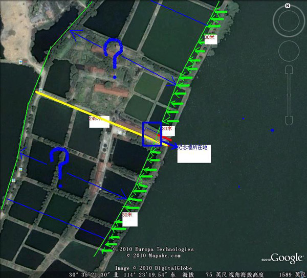
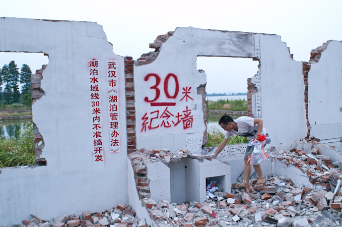
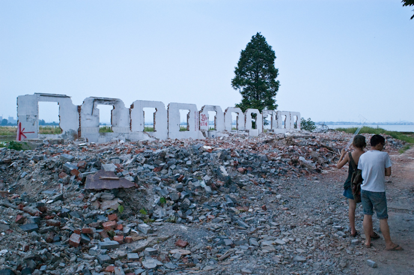
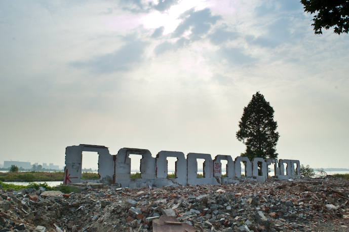
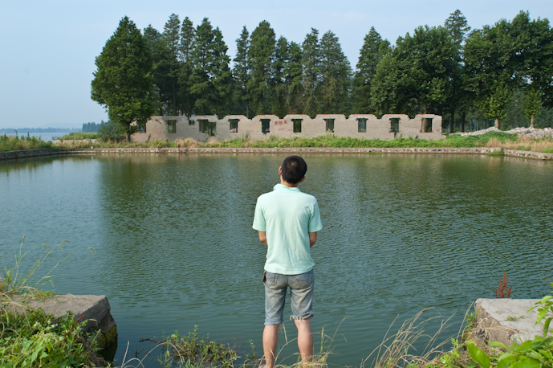

武汉市政府出台《湖泊管理条例》:“湖泊水域线 30 米内不准搞开发”。我们在湖边正在拆迁 的东湖渔场宿舍发现一段残墙恰好是 33.7 米，并与湖岸呈垂直状态，被我们命名为:东湖三十米 纪念墙。该墙能真实的反映武汉市《湖泊管理条例》中所谓水域线 30 米到底有多宽。

*这面残存与废墟上的墙也让我们看到了这样的 30 米――一个安慰性和权力的数字是从何处诞生的 这个数字的母体不是一个相关公务员的环保意识，而是一个破坏者所用来化解其破坏所催生的反 对意见的公关手法的结果。无意中，渔场、拆迁者(工人或者监督者)与我们完成了这样一件作 品:在生态破坏的废墟中，破坏者清晰地展示了其宣言所暗藏的“猫腻”。* (引用自《三十米纪念墙》，麦巅，东湖艺术计划网站，2010 )

The Wuhan municipal government promulgated the _Lake Management Regulations_: "No development is permitted within 30 meters of the lake waterline." By the lake, in the East Lake Fish Farm dormitories undergoing demolition, we found a remnant wall measuring exactly 33.7 meters, running perpendicular to the shore. We named it the **East Lake Thirty-Meter Memorial Wall**. This wall vividly reflects just how wide the so-called "30-meter waterline" defined in the regulations actually is.
*Standing amid the ruins, this remaining wall reveals the true origins of such a 30-meter boundary—a figure driven by power and empty pacification. The genesis of this number lies not in the environmental consciousness of a civil servant, but in a public-relations maneuver used by the destroyer to neutralize opposition sparked by its own destruction. Unintentionally, the fish farm, the demolition crew (workers and supervisors), and we together completed this artwork: amid the ruins of ecological destruction, the destroyer starkly exposed the **hidden agenda** behind its own manifesto.* _(Quoted from "Thirty-Meter Memorial Wall", Mai Dian, East Lake Art Project website, 2010)_
more: http://www.donghu2010.org/2010/member.php?id=41

三十米纪念墙 
乌云+子杰+麦巅 
行为/事件，喷漆，影像记录 
东湖艺术计划 ，武汉，2010

**Thirty-Meter Memorial Wall**
Wuyun + Zijie + Mai Dian
Performance / event, spray paint, video documentation
East Lake Art Project，Wuhan, China, 2010

