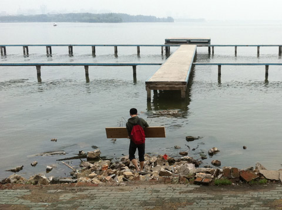
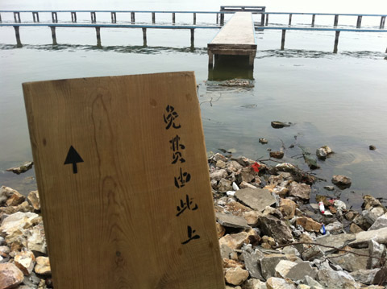
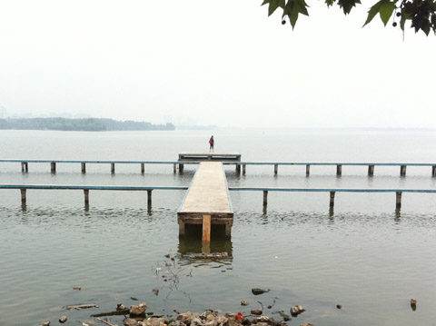

五月初武汉大学凌波门外东湖栈桥因为某原因被拆掉部分，并在其上几个口子安装了铁栅栏， 禁止人们进入;该处或另建为游船码头，入湖游赏则再行收费。由此东湖上将又失去一块能够自 由享受湖景的看台，失去一个免费的夏泳胜地。我将一块木料写上了“免费由此上↑”字样，安置到 凌波门栈桥:因为木材不够长，只好一头插在水里，一头搭在栈桥水泥板上，成为一个倾斜的坡 道。我凭借这个坡道，得以走上栈桥，看到更美的东湖景色。
In early May, part of the East Lake trestle pier outside Wuhan University's Lingbo Gate was demolished for unknown reasons, and iron railings were installed across several openings to forbid access. The site was rumored to be converted into a commercial boat dock that would charge fees for lake excursions. Thus, East Lake was about to lose yet another public platform for freely enjoying the lake scenery, as well as a popular free summer swimming spot.
I wrote the words _"Free to go (into the Lake from here) ↑"_ on a **wooden plank** and placed it at the Lingbo Gate pier. Since the wood was not long enough, one end had to be planted in the water while the other rested on the pier's concrete slab, creating an inclined ramp. **With this ramp**, I was able to walk onto the pier once again and take in a finer view of East Lake.
more：http://www.donghu2010.org/2012/view.php?id=11

免费由此上 
行为/事件，过山车轨道枕木木板，镂刻版印刷 
东湖艺术计划 ，武汉，2012

子杰漫游东湖 
北京当代艺术基金会，亚洲当代艺术周(ACAW) 
MANA 当代艺术中心，纽约，美国，2017

**Free to Go (into the Lake from Here)**
Performance / event, wooden roller coaster sleeper plank, stencil printing
East Lake Art Project，Wuhan, China, 2012

Zijie visits East Lake
Beijing Contemporary Art Foundation (BCAF), Asia Contemporary Art Week (ACAW)
Mana Contemporary, New York, USA, 2017

