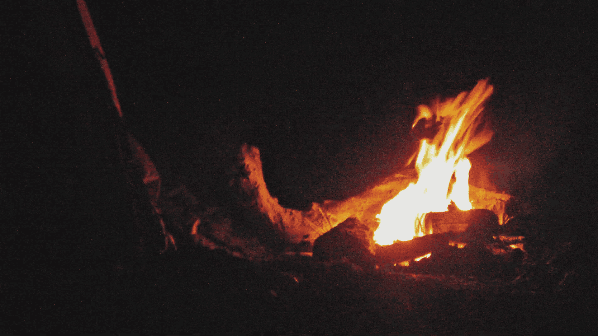
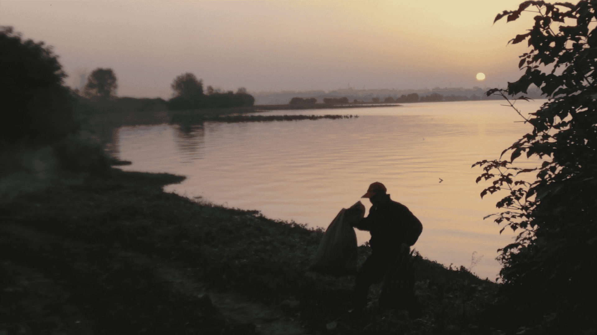
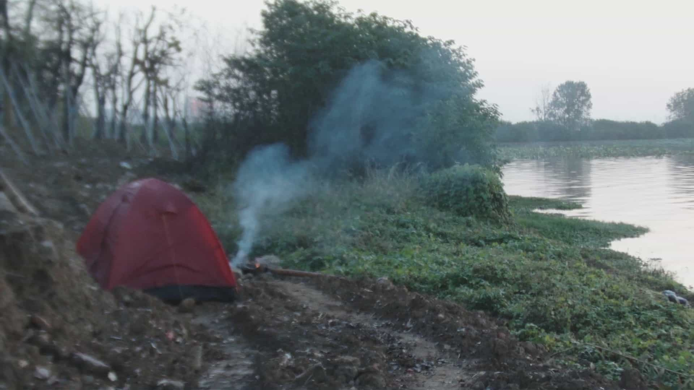
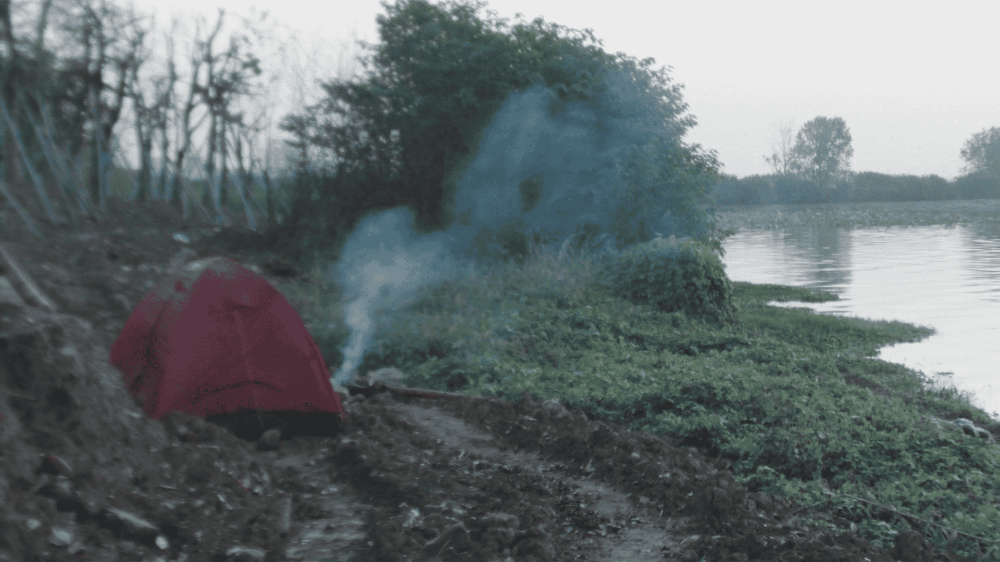
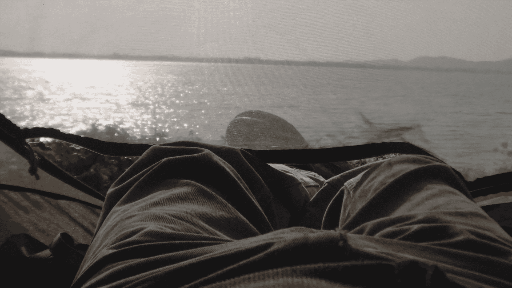
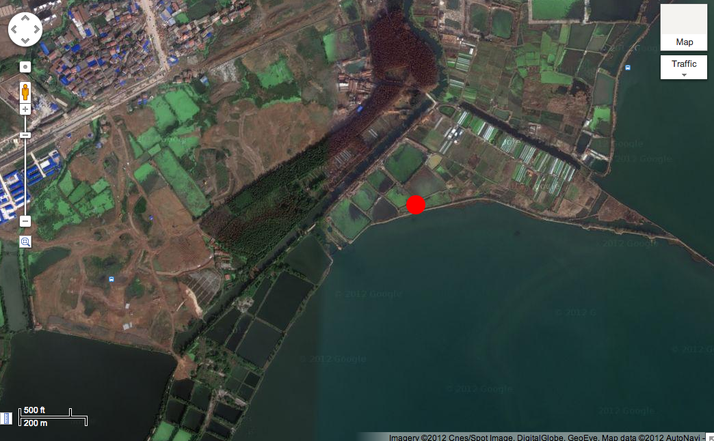

东湖渔场以后要建一个五星级酒店:森严的门禁，昂贵的宾馆套房和“衣冠不整不得入内”;进 入该处恐怕就没有那么容易。我决定到渔场住一个晚上，欣赏湖景，亲近自然，同时也是免费和 自由的。11 月 4 号晚上带上行装，坐公共汽车去渔场;伴着欢乐的噪声我在湖边搭起帐篷生起了火堆。次日日出时分，和捕鱼者瞎聊，他说来年开春若来可见无数比大腿还粗的鲤鱼跳出水面， 一跃十几米。

The East Lake Fish Farm is slated to be replaced by a five-star hotel: strict access control, expensive suites, and a "no entry if improperly dressed" policy — getting in would no longer be so easy. I decided to spend a night at the fish farm to enjoy the lake view and get close to nature, **freely and at no cost**.
On the evening of November 4th, I packed my gear and took a bus to the fish farm; amid cheerful noise, I pitched a tent by the lake and lit a campfire. At sunrise the next day, I chatted with a fisherman, who said that if I came back the following spring, I would see countless carp thicker than a thigh leaping out of the water, soaring over ten meters high.

渔场的一夜 
行为/事件，帐篷 
东湖艺术计划 ，武汉，2012

子杰漫游东湖
北京当代艺术基金会，亚洲当代艺术周(ACAW) 
MANA 当代艺术中心，纽约，美国，2017

One Night at Fish Farm
Performance/event, tent
East Lake Art Project，Wuhan, China, 2012

Zijie visits East Lake
Beijing Contemporary Art Foundation (BCAF), Asia Contemporary Art Week (ACAW)
Mana Contemporary, New York, USA, 2017

