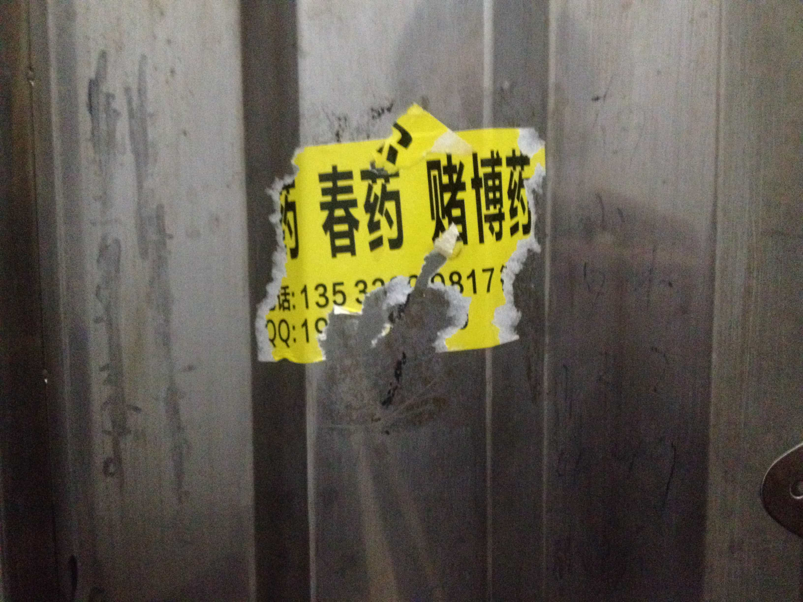
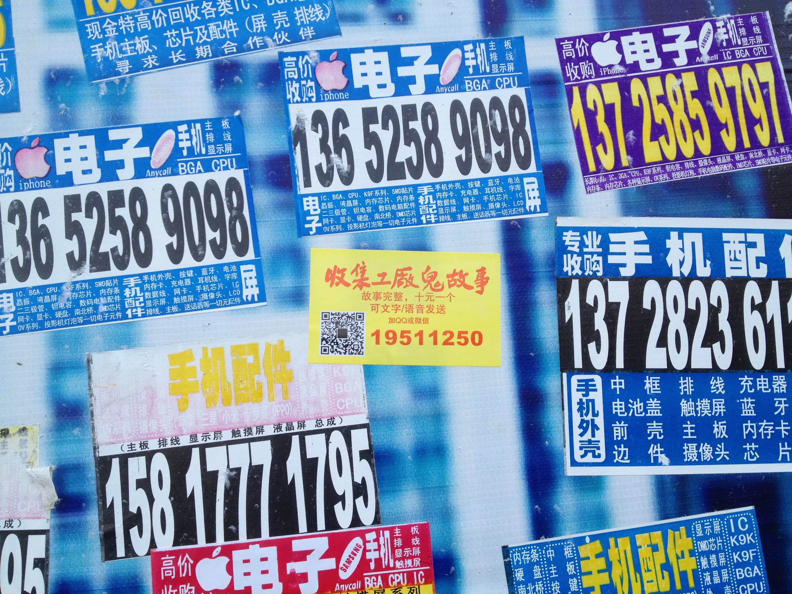
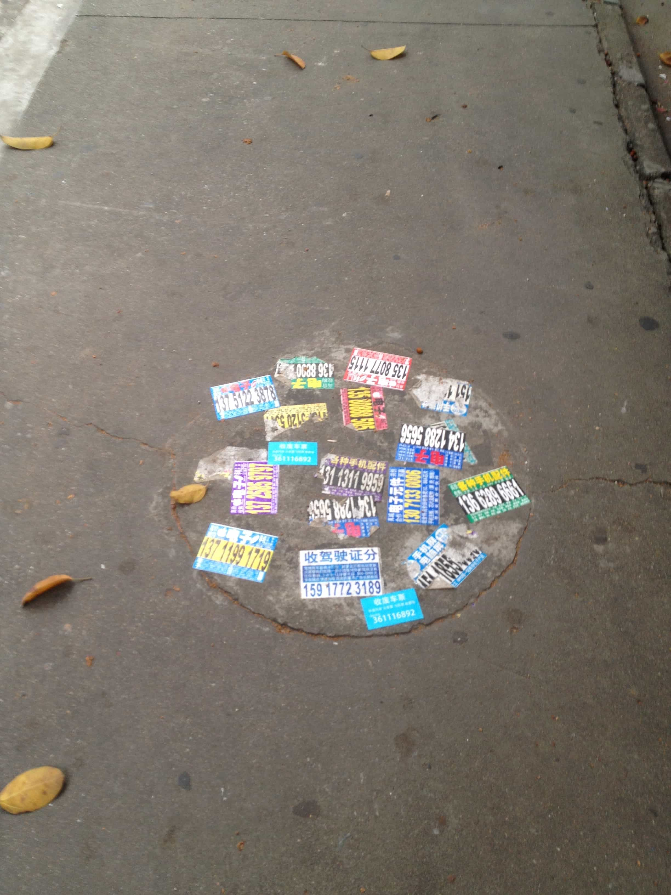
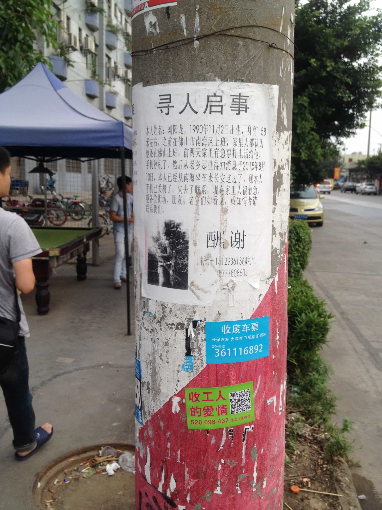
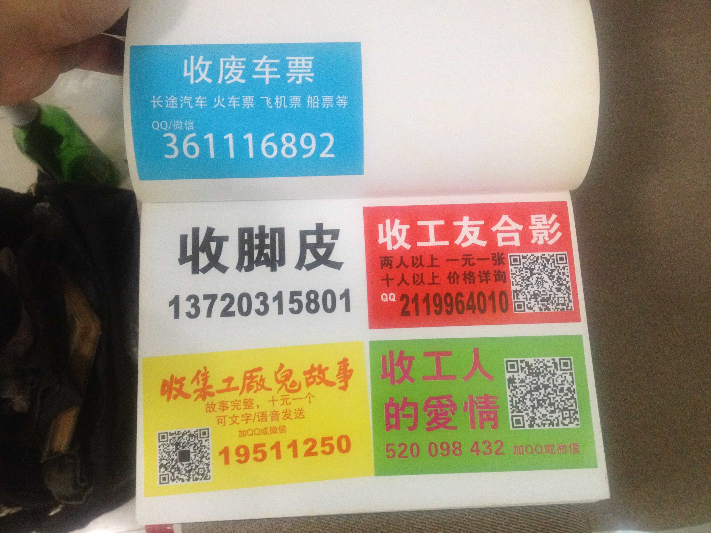
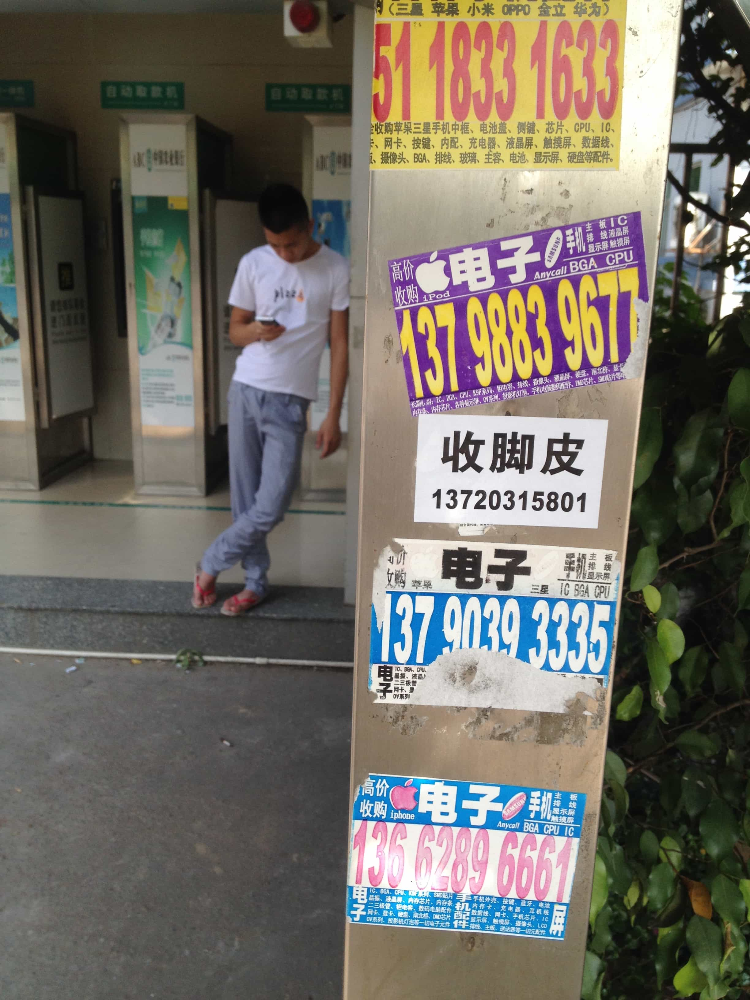
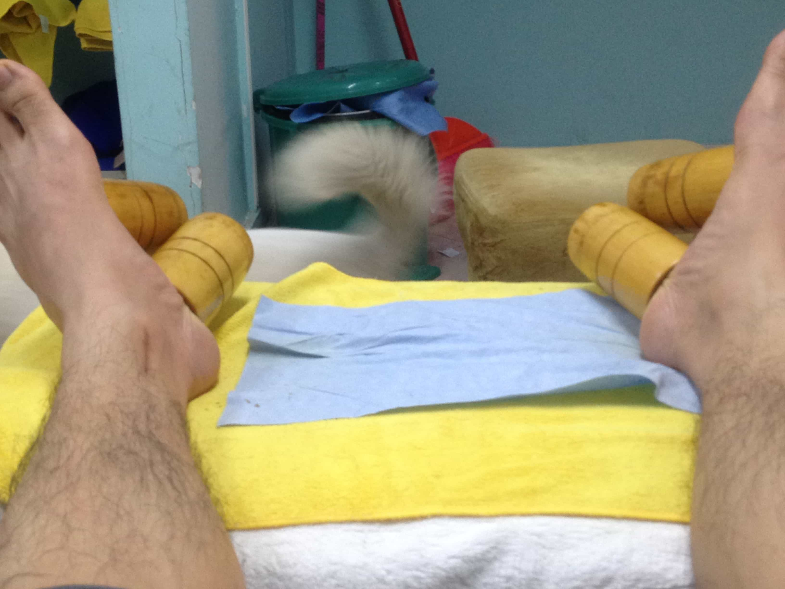

我在东莞长安邀请其他几个朋友(黄淞浩、唐潮、刘亚、余果)入股做了一堆小广告，包括:收脚 皮，收集工友合影、收废车票、收工人的爱情、收集工厂鬼故事等。我们一边在这个城镇厂区闲 逛，把广告贴到墙上更斑驳的广告缝隙里。随后我从修脚店得到了一些当地工人的脚皮，准备做 成美容面膜。
*脚是工作时最容易被忽略的部分--特别是当下机器替代让身体藏匿得更深--也是和土地联系 最紧密的肢体，剥开层层外壳去按摩这个隐形的柔软部位才会让这些人失声呻吟喊些真心的爽快， 脚皮就是心底(就和修脚按摩店的脚底穴位图一样，穴位连着心脏脾肺)的见证。* (引用自《脚皮在一系列的叙述中》，子杰，腹地计划项目，石青)

In Chang'an, Dongguan, I invited several friends (Huang Songhao, Tang Chao, Liu Ya, and Yu Guo) to chip in and produce a series of small street classifieds, including: collecting foot skin, gathering photos of fellow workers, buying used train tickets, collecting workers' love stories, and gathering factory ghost stories, among others. We wandered through this industrial town, pasting our flyers into the gaps between the peeling, faded ads on the walls. Later, I obtained some foot skin from local workers at a **foot-reflexology parlor**, intending to process it into a beauty face mask.
*The foot is the most easily neglected part of the body during work—especially today, as automation and machine substitution hide the body even deeper—yet it remains the limb most closely bound to the earth. Only by peeling away layered shells to massage this invisible, tender spot can these workers let out genuine groans of relief and pleasure. The foot skin stands as a witness to their inner depths (just like the foot acupoint chart in a **foot-reflexology parlor** links the points directly to the heart, spleen, and lungs).*

收脚皮
行为/事件，影像记录，人体足部外表皮 
腹地计划，广东时代美术馆，2015

_(Quoted from "Foot-Skin in a Series of Narratives" by Zijie, Hinterland Project, curated by Shi Qing)_

Collecting Foot-Skin
Performance/event, video documentation, human foot epidermis
Hinterland Project，Guangdong Times Museum, 2015

