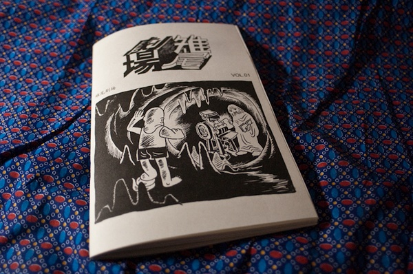
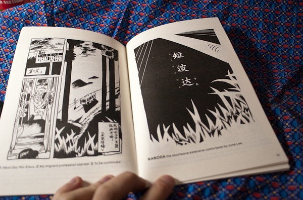
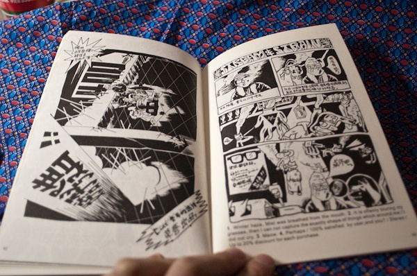
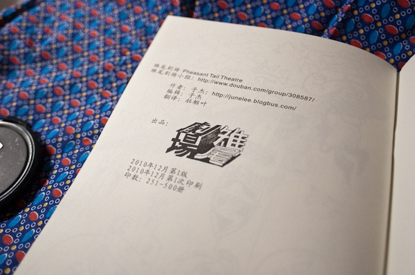
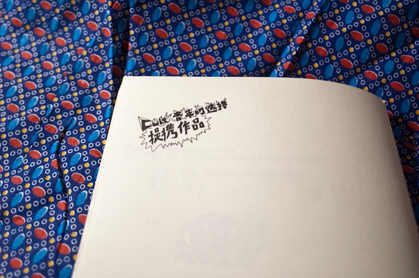

雉尾剧场是子杰长期进行的漫画刊物和自出版项目。从 2010 年开始每期的印数不到 400 本;到现 在已经有了 5 期:第一期、第 1.2 期、第 1.5 期、第 1.6 期和第二期，其中有小数点的是属于比较实验性的漫画。近期创作的短篇漫画也以雉尾剧场为出品方直接结集印行。

**_Pheasantail Theatre_** is an ongoing comics zine and self-publishing project by Zijie. Since its launch in 2010, each issue has had a limited print run of fewer than 400 copies. To date, five issues have been released: Issue 1, Issue 1.2, Issue 1.5, Issue 1.6, and Issue 2—with those bearing decimal numbers leaning toward the experimental. His recent short-form comics have also been collected and published directly under the _Pheasantail Theatre_ imprint.

雉尾剧场 
漫画出版物 
印行茶会，YAL 我们家青年自治实验室，武汉，2010-ongoing

安古兰漫画节，2010
蓬皮杜艺术中心，2012
法国国家图书馆，2013

Pheasantail Theatre
Comics publication
Publication Tea Salon, "Our Home" Youth Autonomous Lab (YAL), Wuhan, China, 2010–ongoing

Angoulême International Comics Festival, 2010
Centre Pompidou, 2012
Bibliothèque nationale de France, 2013

