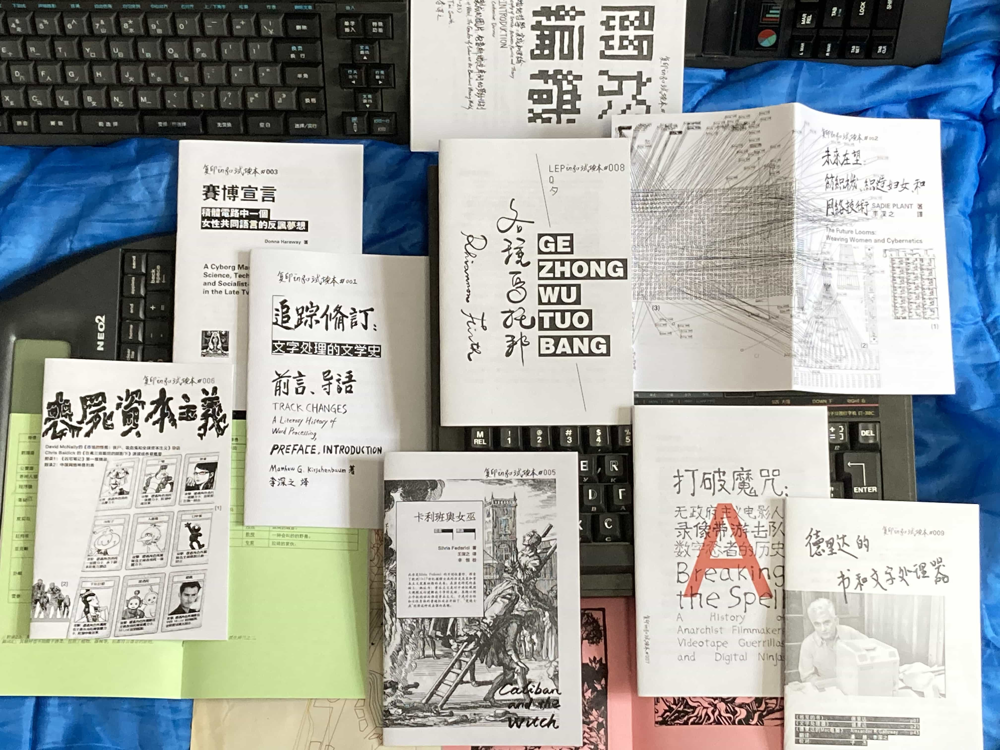

在研究“中文文字处理机:写作、技术、权力和资本”期间翻译了 Matthew Kirschenbaum的著作《追踪 修订:文字处理的文学史》(Track Changes: A Literary History of Word Processing by Matthew G. Kirschenbaum)。该翻译是我用DeepL机器翻译人工校对的结果，由此我陆续选译了一系列和技术、写作、 女性相关的书籍前言或经典文本作为试读本(ARC zine)出版:

#001《追踪修订:文字处理的文学史》前言、导语 
#002《未来在望:纺织机、织造妇女和网络技术》 
#003《赛博宣言》(台译)
#004《关于编织》 
#005《卡利班和女巫》前言、导语 
#006《丧尸资本主义》
#007《打破魔咒：无政府主义电影人、录像带游击队和数字忍者的历史》导语、结语
#006《各种乌托邦》
#006《德里达的书和文字处理器》
……

*谁是文字处理的第一批采用者?他们有什么样的焦虑?文字处理被认为只是一个更好的打字机， 还是意味着更多?它是如何改变我们对写作的理解的?看似不可言喻的写作行为如何总是建立在 特定的工具和媒体之上，从鹅毛笔到键盘...... 一路走来，我们发现了可能是第一个用文字处理器 写小说的人，探索了流行文学和严肃文学作家采用这种技术的各种令人惊讶的缘由，追寻了小说 和诗歌中来自文字处理的新隐喻和想法的传播，并思考文学、学术和记忆在这个时代的命运，特别当写作者的最后遗留物可能只能是硬盘上的文件夹或云中之物时。*(《追踪修订:文字处理的文学史》简介)
更多: https://fuyininfo.github.io/post/fuyininfo-books-202110/

While conducting research on _"Chinese Word Processor: Writing, Technology, Power, and Capital,"_ I translated Matthew G. Kirschenbaum's book _Track Changes: A Literary History of Word Processing_. Produced via DeepL machine translation with human post-editing, this translation became the inaugural zine of the **Fuyin-info ARC (Advance Reader Copy) series**. Following this, I translated and published a succession of book prefaces and classic texts exploring technology, writing, and feminism:

#001 Track Changes: A Literary History of Word Processing – Preface & Introduction, by Matthew G. Kirschenbaum
#002 The Future Looms: Weaving Women and Cybernetics, by Sadie Plant
#003 A Cyborg Manifesto: Science, Technology, and Socialist-Feminism in the Late Twentieth Century, by Donna Haraway (Traditional Chinese / Taiwan Edition)
#004 About Weaving (Includes the introduction to A Philosophy of Textile: Between Practice and Theory by Catherine Dormor, and Chapter 1, "'Pictures Made of Wool': The Gender of Labor at the Bauhaus Weaving Workshop (1919–23)," from Bauhaus Weaving Theory by T'ai Smith)
#005 Caliban and the Witch: Women, the Body and Primitive Accumulation, by Silvia Federici (Preface & Introduction)
#006 Zombie Capitalism (Excerpts investigating the rise of capitalism through the prism of body-panics, from Monsters of the Market by David McNally)
#007 Breaking the Spell: A History of Anarchist Filmmakers, Videotape Guerrillas, and Digital Ninjas, by Chris Robé (Introduction & Conclusion)
#008 Various Utopias
#009 Derrida on Books and Word Processors
……

more: https://fuyininfo.github.io/post/fuyininfo-books-202110/

复印试读本系列系列 
翻译文本，纸质印刷品 
复印info，武汉，2020-2023

纸质读本
杭州纤维三年展，2022

纸张裁切
上海双年展，2023

**Fuyin-info ARC Series**
Translated texts, printed matter
Fuyin.info, Wuhan, China, 2020–2023

**Paper Readers**
Hangzhou Triennial of Fiber Art, Hangzhou, China, 2022

**Paper Trimmings**
Shanghai Biennale, Shanghai, China, 2023

